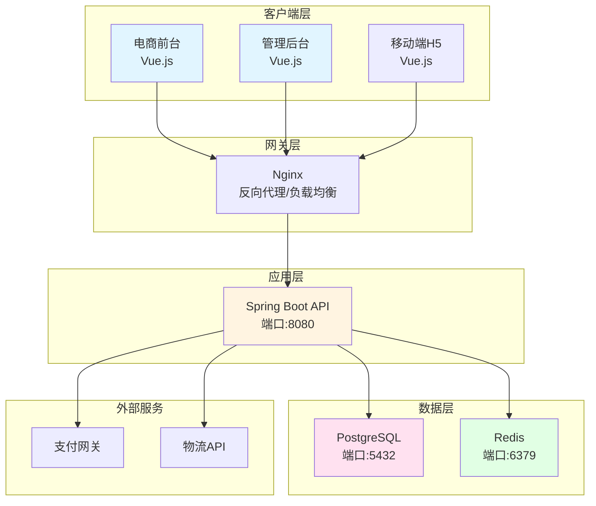
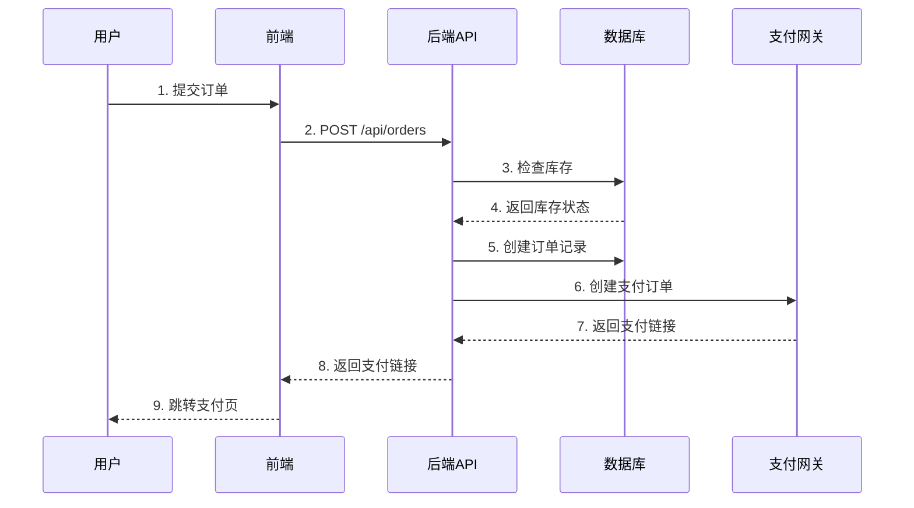
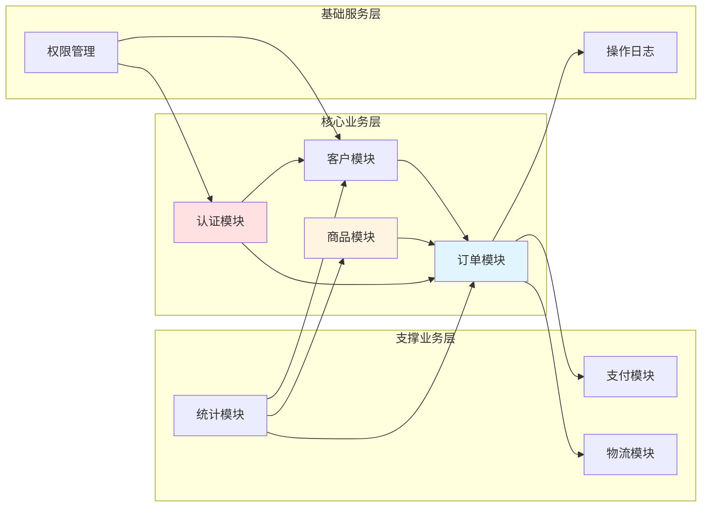
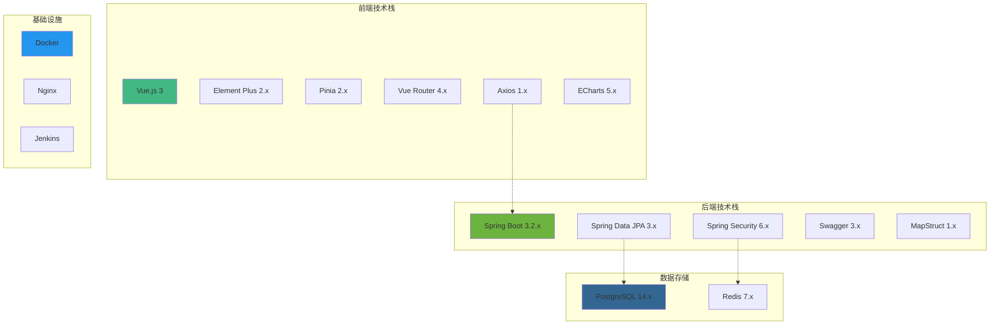

# 项目启动工作流 v2.2（标准工具版）

## 概述

本 Skill 提供完整的项目启动自动化工作流，支持三种工作模式：
- **新项目模式**：从零开始的 6 阶段全自动流程（仅1次确认）
- **迭代模式**：在现有项目上增量添加新功能
- **开发执行模式**：按任务清单开发已定义的功能

**注意：** 工作模式选择和流程编排由 `project-bootstrapper` Agent 负责

---

## ⚠️ 文件操作规范

**优先使用文件操作工具：**

1. **创建新文件**：使用 `write_to_file` 工具
   ```python
   write_to_file(
       filePath="文件路径",
       content="文件内容"
   )
   ```

2. **编辑已有文件**：使用 `replace_in_file` 工具
   ```python
   replace_in_file(
       filePath="文件路径",
       old_str="旧内容",
       new_str="新内容"
   )
   ```

3. **读取文件**：使用 `read_file` 工具
   ```python
   read_file(filePath="文件路径")
   ```

**关键原则：**
- 始终优先使用文件操作工具，而非命令行
- 使用 `write_to_file` 创建文件时，目录会自动创建
- 避免不必要的命令执行
- 使用绝对路径，避免相对路径问题

---

## ⚠️ 文件集中管理规则（关键）

### 核心原则

**当用户指定了具体项目目录时，所有生成的文档必须在该目录下！**

例如用户说 "根据 cyberpunk-backend/xxx.md 进行开发"，则：
- 项目目录 = `cyberpunk-backend/`
- 所有 docs、sql、prototype 必须在 `cyberpunk-backend/` 下

### 标准目录结构

```
{项目目录}/                      # 用户指定的目录，如 cyberpunk-backend/
└── docs/                        # 📁 文档根目录
    └── {timestamp}/            # 📁 时间戳子目录（如：20260115-143000）
        ├── PRD.md                  # 产品需求文档
        ├── architecture.md         # 系统架构（含Mermaid图）
        ├── database-design.md      # 数据库设计
        ├── frontend-tasks.md       # 前端任务清单
        ├── backend-tasks.md        # 后端任务清单
        ├── func.md                 # 功能清单与状态
        ├── api/                    # API文档集中管理
        │   ├── index.md
        │   └── ...
        ├── sql/                    # 📁 数据库脚本（在时间戳目录下）
        │   ├── schema.sql
        │   └── init-data.sql
        └── prototype/              # 📁 原型页面（在时间戳目录下）
            ├── index.html
            ├── dashboard.html
            ├── css/styles.css
            ├── js/main.js
            └── README.md
```

### ❌ 禁止行为

- ❌ 在工作区根目录创建分散的 docs/、sql/ 目录
- ❌ 在项目根目录单独创建 sql/、prototype/ 目录（必须在 docs/{timestamp}/ 下）
- ❌ 跳过原型设计阶段
- ❌ 文档分散在多个位置
- ❌ 覆盖之前的时间戳目录（每次必须生成新的时间戳）

### ✅ 必须遵守

- ✅ 检测用户指定的项目目录
- ✅ 生成当前时间戳（格式：YYYYMMDD-HHmmss）
- ✅ **所有内容集中到 `{项目目录}/docs/{timestamp}/` 下**（文档、原型、SQL都在此目录）
- ✅ 原型页面生成到 `{项目目录}/docs/{timestamp}/prototype/` 下
- ✅ SQL 脚本放到 `{项目目录}/docs/{timestamp}/sql/` 下
- ✅ 每次生成独立的时间戳目录，避免覆盖之前的内容
- ✅ 时间戳必须是当前时间，不得手动指定

---

## ⚠️ 核心改进（v2.2）

### 自动化特性

| 特性 | 优化前 | 优化后 |
|------|--------|--------|
| 人工确认次数 | 5-6次 | **1次**（技术栈确认） |
| 技术栈选择 | 全手动 | **智能推荐** |
| 设计风格 | 需要选择 | **自动推断** |
| 执行方式 | 分阶段停顿 | **一次性完成** |
| 架构图 | 无/可选 | **必须含Mermaid** |
| 原型设计 | 可选 | **必须生成** |
| 文件路径 | 分散 | **集中到项目目录** |
| 文件操作 | - | **Write工具（可能需要确认）** |

### 关键行为规则变更

#### 新规则1：唯一确认点

**仅在一个环节需要用户确认：**
```
阶段1：配置确认（技术栈、功能清单）
     ↓ 确认后自动执行
阶段2-6：全自动执行，无需中途确认
```

**禁止行为：**
- ❌ 在阶段2-6之间插入 STOP 标记
- ❌ 要求用户确认 PRD 内容
- ❌ 要求用户选择设计风格
- ❌ 要求用户确认开发方案

**说明：** 文件写入优先使用 `write_to_file` / `replace_in_file` 工具。

#### 新规则2：智能推断

**自动推断逻辑：**

**技术栈推断：**
```python
if project_type == "管理后台":
    frontend = "Vue.js + Element Plus"
    backend = "Spring Boot"
    database = "PostgreSQL"
elif project_type == "电商前台":
    frontend = "Vue.js + Element Plus"
    backend = "Spring Boot"
    database = "PostgreSQL"
elif project_type == "移动端H5":
    frontend = "Vue.js + Vant"
    backend = "Node.js + Express"
    database = "MongoDB"
```

**设计风格推断：**
```python
if "管理" in project_name or "后台" in project_name:
    style = "简约现代风格（Element Plus风格）"
elif "电商" in project_name:
    style = "活力渐变风格（适合C端）"
elif "数据" in project_name or "监控" in project_name:
    style = "暗黑科技风格（适合大屏）"
else:
    style = "简约现代风格"
```

#### 新规则3：架构可视化强制要求

**architecture.md 必须包含：**
1. 整体架构图（Mermaid graph）
2. 数据流图（Mermaid sequenceDiagram）
3. 模块依赖图（Mermaid graph）
4. 技术栈层次图（Mermaid graph）

**检查点验证：**
```
✅ 包含至少1个 Mermaid 图表
✅ 图表语法正确，可渲染
✅ 图表描述完整，覆盖系统核心模块
```

#### 新规则4：PRD 质量强制要求

**详尽完整的 PRD 必须包含：**

**第1章：项目概述**
- 项目背景与目标
- 核心价值主张
- 目标用户群体
- 市场定位

**第2章：功能需求（核心）**
- 10大功能模块详细描述
- 每个功能模块包含：
  * 功能概述
  * 用户故事（User Story）
  * 功能点拆分（至少5-10个点）
  * 优先级（P0/P1/P2/P3）
  * 验收标准

**第3章：非功能需求**
- 性能需求（响应时间、并发量）
- 安全需求（认证、授权、加密）
- 可用性需求（SLA、容灾）
- 可维护性需求（日志、监控）

**第4章：系统架构**
- 技术选型说明
- 系统分层架构
- 数据流向
- 接口设计原则

**第5章：界面设计**
- 页面清单（每个页面必须有详细描述）
- 交互设计说明
- 响应式适配方案

**第6章：数据模型**
- 核心实体定义
- 实体关系说明
- 数据字典（枚举值定义）

**第7章：里程碑规划**
- 6个里程碑，每个里程碑包含：
  * 交付物
  * 时间预估
  * 依赖关系

**检查点验证：**
```
✅ 章节完整（7章全覆盖）
✅ 功能点数量（至少30+个功能点）
✅ 页面清单详细（每个页面有描述）
✅ 里程碑规划清晰（6个Milestone）
```

---

## 阶段执行指南

### 阶段1：深度需求分析

**任务：** 对用户需求进行全方位分析

**分析维度：**
1. **业务领域分析**
   - 行业特征（电商/管理/社交/金融等）
   - 业务模式（B2B/B2C/O2O等）
   - 竞品分析（如果有）

2. **用户群体分析**
   - 目标用户（B端企业/C端消费者）
   - 用户规模预估（100/1k/10k/100k+）
   - 用户画像（年龄、技术能力等）

3. **功能复杂度评估**
   - 核心功能数量（5-10个模块）
   - 功能点总数（30-100+个点）
   - 模块依赖关系

4. **技术挑战识别**
   - 高并发场景（秒杀、抢购）
   - 大数据处理（报表、统计）
   - 实时性要求（WebSocket、长连接）
   - 数据一致性（分布式事务）

**输出格式：**
```markdown
【需求分析报告】

## 📊 业务领域
- 行业类型：{电商/管理/社交/...}
- 业务模式：{B2B/B2C/O2O}
- 核心价值：{一句话描述项目价值}

## 👥 用户群体
- 目标用户：{B端/C端}
- 预估规模：{数量级}
- 用户画像：{关键特征}

## ⚙️ 功能复杂度
- 模块数量：{N}个
- 功能点总数：{M}个
- 复杂度等级：{低/中/高}
- 依赖关系：{描述}

## 🔧 技术挑战
1. {挑战点1} - {严重性/解决思路}
2. {挑战点2} - {严重性/解决思路}
3. {挑战点3} - {严重性/解决思路}

## 💡 智能推荐技术栈
- 前端：{推荐框架} + {推荐组件库}
- 后端：{推荐框架}
- 数据库：{推荐数据库}
- 缓存：{Redis/无}
- 消息队列：{RabbitMQ/无}
```

---

### 阶段2：配置确认（唯一确认点）

**任务：** 展示完整配置，等待用户确认

**确认模板：**
```markdown
【项目启动配置确认】

## 📋 基本信息
- 项目名称：{项目名称}
- 项目类型：{电商前台/管理后台/移动端H5/...}

## 🎨 设计风格
- 推荐风格：{智能推荐风格}
- 风格说明：{风格描述}

## 🛠️ 技术栈
### 前端技术
- 框架：{Vue.js / React / Angular}
- UI组件库：{Element Plus / Ant Design / ...}
- 状态管理：{Pinia / Redux / ...}
- 路由：{Vue Router / React Router}
- HTTP客户端：{Axios / Fetch}

### 后端技术
- 框架：{Spring Boot / FastAPI / ...}
- ORM框架：{Spring Data JPA / SQLAlchemy / ...}
- 安全框架：{Spring Security / JWT / ...}
- API文档：{Swagger / OpenAPI}

### 数据存储
- 数据库：{PostgreSQL / MySQL / MongoDB}
- 缓存：{Redis / Memcached / 无}
- 对象存储：{OSS / 本地}

## 📦 核心功能模块
{列出所有功能模块，每个模块包含功能点数量}

## 📊 项目预估
- 前端任务：{N}个，预计{X}人天
- 后端任务：{M}个，预计{Y}人天
- 总工时：{Z}人天
- 预计周期：{T}周（1人开发）

━━━━━━━━━━━━━━━━━━━━━━━━━━━━━━━━━━━━━━━━━━━━━━
⛔ 唯一确认环节

**请选择操作：**
1. 输入 "确认" → 自动完成全部6个阶段（无需中途干预）
2. 输入 "修改：技术栈 React" → 修改配置
3. 输入 "修改：功能 +库存管理" → 增加功能模块
4. 输入 "修改：设计风格 暗黑科技" → 修改设计风格

⚠️ 确认后将自动生成完整项目结构，包含详尽PRD、数据库设计、
   原型页面、任务清单、API文档和可视化架构图！

━━━━━━━━━━━━━━━━━━━━━━━━━━━━━━━━━━━━━━━━━━━━━━
```

**用户确认后，进入阶段3自动执行流程。**

---

### 阶段2：确定项目目录（关键步骤）

**任务：** 准确识别项目目录，确保所有文件生成到正确位置

**项目目录识别规则（必须严格遵守）：**

| 用户输入示例 | 项目目录 | 说明 |
|-------------|----------|------|
| `/start 订单管理系统` | `当前工作目录/` | 在工作区根目录创建 |
| `/start @/path/to/需求.md` | `/path/to/` | 需求文档所在目录 |
| `在 cyberpunk-backend/ 下开发` | `cyberpunk-backend/` | 用户指定的目录 |
| `基于 /d:/project/xxx.md` | `d:/project/` | 绝对路径所在目录 |

**关键原则：**
1. ✅ **检测 @ 符号路径**：如果使用 `/start @/path/to/file.md`，项目目录 = `path/to/`
2. ✅ **检测目录提及**：如果用户说"在 xxx/ 下开发"，项目目录 = `xxx/`
3. ✅ **使用绝对路径**：所有文件路径使用 `项目根目录/{文件相对路径}` 格式
4. ✅ **一致性原则**：一旦确定项目目录，所有阶段都使用同一个目录

**项目目录确定后的输出格式：**
```
【项目目录已确定】
📁 项目根目录：{绝对路径}
📁 集中目录：{项目根目录}/docs/{timestamp}/（所有文档、原型、SQL都在此目录下）
📝 时间戳：YYYYMMDD-HHmmss（如：20260115-143000）
```

**示例：**
```
用户输入：/start 订单管理系统

识别结果：
📁 项目根目录：当前工作目录（如：d:/project/backend/）
📁 集中目录：{项目根目录}/docs/{timestamp}/（所有文档、原型、SQL都在此目录下）
📝 时间戳：20260115-143000（示例）
```

---

### 阶段3：自动全流程执行

**执行原则：** 一次性完成所有阶段，无需中途确认

**关键行为规范（必须遵守）：**
1. ✅ 一次性完成所有6个阶段，不停顿
2. ✅ 调用子 skills 时，在 prompt 中明确指定参数，避免询问
3. ✅ 遇到需要选择的情况（如设计风格），自动推断或使用推荐值
4. ✅ 文件已存在时，直接覆盖或跳过（根据需求）
5. ✅ 禁止插入 STOP 标记或等待用户确认
6. ✅ 所有子阶段连续执行，不停顿
7. ⚡ **优先使用 Write 工具**（write_to_file/replace_in_file）
8. ⚡ **仅在创建目录时使用 execute_command**
9. 🚨 **任务清单生成规则**：所有子任务必须使用 `[ ]`（待办状态），严禁使用 `[x]`（已完成状态）
10. 🎯 **文件路径规则**：所有文件路径必须使用 `{项目根目录}/docs/...` 格式

**文件操作规范（关键）：**

```python
# ✅ 正确方式：使用项目根目录的绝对路径和时间戳
PROJECT_ROOT = 当前工作目录  # 在阶段2根据用户输入动态确定
TIMESTAMP = "20260115-143000"  # 当前时间戳（格式：YYYYMMDD-HHmmss）

# 创建目录（使用 execute_command）
execute_command(
    command=f'New-Item -ItemType Directory -Force -Path "docs/{TIMESTAMP}", "docs/{TIMESTAMP}/sql", "docs/{TIMESTAMP}/prototype"',
    requires_approval=False
)

# 写入新文件（使用 write_to_file，使用绝对路径和时间戳）
write_to_file(
    filePath=f"{PROJECT_ROOT}docs/{TIMESTAMP}/PRD.md",
    content="# PRD 文档\n\n## 1. 概述\n内容..."
)

# 编辑已有文件（使用 replace_in_file，使用绝对路径和时间戳）
replace_in_file(
    filePath=f"{PROJECT_ROOT}docs/{TIMESTAMP}/PRD.md",
    old_str="旧内容",
    new_str="新内容"
)
```

**❌ 错误方式：**
```python
# ❌ 错误：使用相对路径，可能在错误的目录生成文件
write_to_file(
    filePath="docs/PRD.md",  # 会在当前工作目录生成，而非项目目录
    content="..."
)
```

**子 skills 调用规范：**
- 使用 `use_skill` 命令调用
- 在 prompt 中明确传递项目根目录路径
- 示例：`use_skill(command="skill-name", prompt="项目根目录为：{PROJECT_ROOT}，请生成...")`

#### 子阶段3-1：生成详尽 PRD

**PRD 质量标准：**

| 检查项 | 标准 |
|---------|------|
| 章节完整 | 7章全覆盖 |
| 功能点数量 | ≥30个 |
| 用户故事 | 每个功能至少1个 |
| 验收标准 | 每个功能点有验收标准 |
| 页面清单 | 每个页面有详细描述 |

**PRD 章节结构：**

```markdown
# {项目名称} 产品需求文档 v1.0

## 1. 项目概述
### 1.1 项目背景
### 1.2 项目目标
### 1.3 核心价值
### 1.4 目标用户
### 1.5 市场定位

## 2. 功能需求
### 2.1 {模块1名称}
#### 功能概述
#### 用户故事
#### 功能点（5-10个）
- 功能点1：{描述} | 优先级：P0 | 验收标准：{标准}
- 功能点2：{描述} | 优先级：P1 | 验收标准：{标准}
...
### 2.2 {模块2名称}
...

## 3. 非功能需求
### 3.1 性能需求
### 3.2 安全需求
### 3.3 可用性需求
### 3.4 可维护性需求

## 4. 系统架构
### 4.1 技术选型
### 4.2 分层架构
### 4.3 数据流向
### 4.4 接口设计

## 5. 界面设计
### 5.1 页面清单
| 页面 | 路由 | 功能描述 | 优先级 |
|------|------|----------|--------|
| {页面1} | /path1 | {描述} | P0 |
| {页面2} | /path2 | {描述} | P1 |
...

### 5.2 交互设计
### 5.3 响应式适配

## 6. 数据模型
### 6.1 核心实体
### 6.2 实体关系
### 6.3 数据字典

## 7. 里程碑规划
| Milestone | 交付物 | 工期 | 依赖 |
|----------|--------|------|------|
| M1 | {交付物} | 2周 | 无 |
| M2 | {交付物} | 3周 | M1 |
...
```

**文件输出：**
- `{PROJECT_ROOT}docs/{timestamp}/PRD.md` - 详尽完整的产品需求文档（PROJECT_ROOT 和 timestamp 在阶段2确定）
  - 迭代模式：包含所有模块（已开发+新模块）
  - 新模块功能点标记为 `待开发`

---

#### 子阶段3-2：数据库设计

**调用 Skill：** `database-design`

⚠️ **关键执行要求**：
调用时使用 `use_skill` 命令，无需确认，直接生成数据库设计。必须明确传递项目根目录：

```
use_skill(command="database-design", prompt="项目根目录：{PROJECT_ROOT}，时间戳：{timestamp}。请根据 PRD 生成 {项目名称} 的数据库设计。要求：生成完整的表结构设计文档（{PROJECT_ROOT}docs/{timestamp}/database-design.md）、建表脚本（{PROJECT_ROOT}docs/{timestamp}/sql/schema.sql）和初始化数据（{PROJECT_ROOT}docs/{timestamp}/sql/init-data.sql），确保所有功能模块的数据模型都已定义，包含完整的索引设计和外键约束。")
```

**前置检查：**
```bash
检查文件存在性：
- {PROJECT_ROOT}docs/{timestamp}/database-design.md → 跳过/创建
- {PROJECT_ROOT}docs/{timestamp}/sql/schema.sql → 跳过/创建
- {PROJECT_ROOT}docs/{timestamp}/sql/init-data.sql → 跳过/创建
```

**设计标准：**

| 检查项 | 标准 |
|---------|------|
| 表数量 | ≥10张表 |
| 索引完整性 | 每个表有主键和必要索引 |
| 外键约束 | 关联表有外键 |
| 注释完整 | 每个表和字段有注释 |
| 测试数据 | 包含至少10条记录 |

**文件输出：**
- `{PROJECT_ROOT}docs/{timestamp}/database-design.md` - 数据库设计文档
- `{PROJECT_ROOT}docs/{timestamp}/sql/schema.sql` - 建表脚本
- `{PROJECT_ROOT}docs/{timestamp}/sql/init-data.sql` - 初始化数据

---

#### 子阶段3-3：原型设计

**调用 Skill：** `frontend-design`

⚠️ **关键执行要求**：
调用时必须使用 `use_skill` 命令，在 prompt 中明确指定项目根目录和设计风格，避免询问用户确认：

```
use_skill(command="frontend-design", prompt="项目根目录：{PROJECT_ROOT}，时间戳：{timestamp}。请为 {项目名称} 生成高保真原型页面。设计风格：简约现代风格（蓝灰配色，Element Plus）。要求：直接生成所有页面到 {PROJECT_ROOT}docs/{timestamp}/prototype/ 目录下，无需询问用户确认，确保所有 PRD 定义的页面都已生成，保持设计风格一致性。")
```

**设计风格自动选择：**

| 项目类型 | 自动应用风格 |
|---------|-------------|
| 管理后台 | 简约现代风格（蓝灰配色，Element Plus） |
| 电商前台 | 活力渐变风格（紫橙渐变，卡片式） |
| 数据大屏 | 暗黑科技风格（深色背景，霓虹高亮） |

**生成标准：**

| 检查项 | 标准 |
|---------|------|
| 页面完整性 | PRD中定义的所有页面 |
| 设计一致性 | 所有页面风格统一 |
| Mock数据 | 每个页面有测试数据 |
| 交互完整 | 关键流程可操作 |

**文件输出：**
```
{PROJECT_ROOT}prototype/
├── index.html          # 前台入口（电商前台）或唯一入口（管理后台）
├── admin.html          # 后台入口（如需前后台分离）
├── css/
│   ├── styles.css      # 全局样式
│   ├── frontend.css    # 前台样式
│   └── admin.css      # 后台样式
├── js/
│   ├── main.js        # 交互逻辑
│   └── mock-data.js   # Mock数据
└── README.md          # 使用说明
```

---

#### 子阶段3-4：任务拆分

**参考规则：** `task-splitting`

**拆分标准：**

| 检查项 | 标准 |
|---------|------|
| 任务粒度 | 每个任务2-8小时 |
| 优先级分布 | P0/P1/P2/P3 合理分配 |
| 依赖关系 | 清晰标注前后依赖 |
| 验收标准 | 每个任务有验收标准 |

**⚠️ 任务状态规范（关键）：**
- 所有子任务初始状态必须为 `[ ]`（未完成）
- 严禁生成 `[x]`（已完成）状态的任务
- 验收标准使用 `[ ]`，方便后续追踪

**任务清单结构：**

```markdown
# {前端/后端}任务清单

## 模块1：{模块名称}

### 任务1：{任务名称} (P0, 4h)
- [ ] 子任务1
- [ ] 子任务2
- [ ] 子任务3

**验收标准：**
- [ ] 标准1
- [ ] 标准2

### 任务2：{任务名称} (P1, 6h)
- [ ] 子任务1
- [ ] 子任务2

**验收标准：**
- [ ] 标准1

## 里程碑
| 里程碑 | 任务范围 | 工期 |
|--------|---------|------|
| M1 | 模块1-2 | 5天 |
...
```

**⚠️ 任务状态规范（重要）：**
- 所有子任务初始状态必须为 `[ ]`（未完成）
- 严禁生成 `[x]`（已完成）状态的任务
- 子任务粒度：每个子任务2-4小时可完成
- 验收标准使用 `[ ]`，方便后续追踪

**文件输出：**
- `{PROJECT_ROOT}docs/{timestamp}/frontend-tasks.md` - 前端任务清单
- `{PROJECT_ROOT}docs/{timestamp}/backend-tasks.md` - 后端任务清单

---

#### 子阶段3-5：API文档生成

**调用 Skill：** `api-documentation`

⚠️ **关键执行要求**：
调用时使用 `use_skill` 命令，无需确认，直接生成 API 文档。必须明确传递项目根目录：

```
use_skill(command="api-documentation", prompt="项目根目录：{PROJECT_ROOT}，时间戳：{timestamp}。请根据 {项目名称} 的功能模块生成完整的 API 文档。要求：覆盖所有功能模块，每个接口包含请求方式、URL、参数说明、响应示例、错误码说明，生成到 {PROJECT_ROOT}docs/{timestamp}/api/ 目录下。")
```

**文档标准：**

| 检查项 | 标准 |
|---------|------|
| 接口完整性 | 覆盖所有功能模块 |
| 请求示例完整 | 每个接口有请求示例 |
| 响应示例完整 | 每个接口有成功/失败响应 |
| 错误码定义 | 完整的错误码表 |
| 数据模型定义 | 所有DTO/Entity有定义 |

**文件输出：**
```
{PROJECT_ROOT}docs/{timestamp}/api/
├── index.md          # API索引
├── auth-api.md       # 认证模块
├── orders-api.md     # 订单模块
├── products-api.md   # 商品模块
├── customers-api.md  # 客户模块
...
```

**每个模块API文档结构：**
```markdown
# {模块名称} API 文档

## 1. 概述

## 2. 接口列表

### 2.1 {接口1名称}
**请求：**
- 方法：POST
- 路径：/api/{module}/{action}
- 认证：Bearer Token
- 参数：
  ```json
  {
    "field1": "value1",
    "field2": 123
  }
  ```

**响应：**
- 成功：200
- 失败：400/401/403/404/500

**示例：**
请求：
```json
{
  "username": "admin",
  "password": "123456"
}
```

成功响应：
```json
{
  "code": 200,
  "message": "登录成功",
  "data": {
    "token": "eyJhbGciOiJIUzI1NiIsInR5cCI6IkpXVCJ9...",
    "user": {...}
  },
  "timestamp": "2026-01-14T10:00:00Z"
}
```

失败响应：
```json
{
  "code": 1001,
  "message": "用户名或密码错误",
  "data": null,
  "timestamp": "2026-01-14T10:00:00Z"
}
```

## 3. 数据模型
### 3.1 {Model1}
| 字段 | 类型 | 必填 | 说明 |
|------|------|------|------|
| field1 | string | 是 | {说明} |
| field2 | integer | 否 | {说明} |

## 4. 错误码
| 错误码 | 说明 | 解决方案 |
|--------|------|----------|
| 1001 | {错误描述} | {解决方案} |
...
```

---

#### 子阶段3-6：系统架构图（强制要求）

**文件：** `{PROJECT_ROOT}docs/{timestamp}/architecture.md`

**必须包含以下4个Mermaid图：**

### 1. 整体架构图



### 2. 数据流图



### 3. 模块依赖图



### 4. 技术栈层次图



**架构图验证标准：**
```
✅ 包含至少4个Mermaid图表
✅ 图表语法正确，可渲染
✅ 图表覆盖系统核心组件
✅ 组件之间的关系清晰
✅ 技术栈层次分明
```

---

## 最终验证与输出

### 检查点验证（阶段3完成后）

**文件清单检查：**

```bash
📁 生成的文件清单

📝 docs/
  ✅ PRD.md (详尽完整，≥30功能点)
  ✅ architecture.md (包含4个Mermaid图)
  ✅ database-design.md (≥10张表)
  ✅ frontend-tasks.md (≥40个任务)
  ✅ backend-tasks.md (≥50个任务)
  ✅ func.md (功能清单与状态)
  ✅ archive/ (文档归档，带时间戳)

📝 docs/api/
  ✅ index.md (API索引)
  ✅ auth-api.md (认证模块)
  ✅ orders-api.md (订单模块)
  ✅ products-api.md (商品模块)
  ✅ customers-api.md (客户模块)
  ✅ payments-api.md (支付模块)
  ✅ shipments-api.md (物流模块)
  ✅ statistics-api.md (统计模块)
  ✅ users-roles-api.md (权限模块)
  ✅ system-api.md (系统功能)

💾 sql/ (在 {timestamp} 目录下)
  ✅ schema.sql (建表脚本)
  ✅ init-data.sql (初始化数据)

🎨 prototype/ (在 {timestamp} 目录下)
  ✅ index.html (前台入口)
  ✅ admin.html (后台入口)
  ✅ css/styles.css (全局样式)
  ✅ css/frontend.css (前台样式)
  ✅ css/admin.css (后台样式)
  ✅ js/main.js (交互逻辑)
  ✅ js/mock-data.js (Mock数据)
  ✅ README.md (使用说明)
```

**质量检查：**

| 检查项 | 通过标准 |
|---------|---------|
| PRD完整性 | 7章全覆盖，≥30功能点 |
| 架构图完整性 | 4个Mermaid图 |
| 数据库设计 | ≥10张表，注释完整 |
| API文档 | ≥50个接口，示例完整 |
| 任务清单 | 前端≥40任务，后端≥50任务 |
| 原型页面 | 所有PRD定义页面已生成 |
| 文件结构 | 集中管理，清晰不分散 |

---

## 项目完成总结模板

```markdown
🎉 项目启动完成！

## 📁 项目结构总览

```
{project-name}/
├── README.md
├── docs/
│   └── {timestamp}/               📁 时间戳目录（如：20260115-143000）
│       ├── PRD.md                   ✅ 详尽完整的产品需求文档
│       ├── architecture.md          ✅ 系统架构（含4个Mermaid可视化图）
│       ├── database-design.md       ✅ 数据库设计
│       ├── frontend-tasks.md        ✅ 前端任务清单
│       ├── backend-tasks.md         ✅ 后端任务清单
│       ├── func.md                  ✅ 功能清单与状态
│       ├── api/                     ✅ API文档集中管理
│       │   ├── index.md             - API索引
│       │   ├── auth-api.md          - 认证模块
│       │   ├── orders-api.md        - 订单模块
│       │   └── ...
│       ├── sql/                    ✅ 数据库脚本（在时间戳目录下）
│       │   ├── schema.sql          - 建表脚本（{N}张表）
│       │   └── init-data.sql       - 初始化数据
│       └── prototype/              ✅ 原型页面（在时间戳目录下）
    ├── index.html             ✅ 电商前台入口
    ├── admin.html             ✅ 管理后台入口
    ├── css/
    │   ├── styles.css        - 全局样式
    │   ├── frontend.css      - 前台样式
    │   └── admin.css        - 后台样式
    ├── js/
    │   ├── main.js          - 交互逻辑
    │   └── mock-data.js     - Mock数据
    └── README.md             - 原型使用说明
```

## 📊 项目统计

- 前端任务：{N}个，预计{X}人天
- 后端任务：{M}个，预计{Y}人天
- API接口：{K}个
- 数据表：{T}张
- 原型页面：{P}个
- 总工时预估：{Z}人天（约{T}周，1人开发）

## 🎯 核心交付物

### 1. 详尽PRD
- ✅ 7章完整覆盖
- ✅ {N}个功能点，每个点有用户故事和验收标准
- ✅ {P}个页面，每个页面有详细描述
- ✅ 6个里程碑规划

### 2. 系统架构文档
- ✅ 整体架构图（Mermaid）
- ✅ 数据流图（Mermaid）
- ✅ 模块依赖图（Mermaid）
- ✅ 技术栈层次图（Mermaid）

### 3. 数据库设计
- ✅ {N}张核心表
- ✅ 完整的索引策略
- ✅ 外键约束保证数据一致性
- ✅ 测试数据支持

### 4. 完整任务清单
- ✅ 前端{N}个任务，粒度2-8小时
- ✅ 后端{M}个任务，粒度2-8小时
- ✅ 优先级合理分配（P0/P1/P2/P3）
- ✅ 依赖关系清晰

### 5. API文档
- ✅ {K}个接口全覆盖
- ✅ 请求/响应示例完整
- ✅ 错误码定义完整
- ✅ 数据模型定义清晰

### 6. 高保真原型
- ✅ {P}个页面完整生成
- ✅ 统一设计风格（{风格名称}）
- ✅ Mock数据支持
- ✅ 完整交互流程

## 🚀 下一步行动

**选项1：全栈开发**
```
/fullstack {功能模块名称}
```
并行生成前后端代码，自动触发代码审查。

**选项2：按模块开发**
```
/dev 实现用户认证模块（后端）
/dev 实现登录页面（前端）
```
分别开发前后端，自动触发代码审查。

**选项3：预览原型**
```bash
cd prototype
python -m http.server 8080
# 访问 http://localhost:8080/index.html
```

**选项4：查看文档**
- 查看详尽PRD：`cat docs/PRD.md`
- 查看架构图：`cat docs/architecture.md`
- 查看任务清单：`cat docs/frontend-tasks.md`

---

## 关键改进总结（v2.0）

| 对比项 | v1.0 | v2.0 |
|--------|-------|-------|
| 人工确认次数 | 5-6次 | **1次** |
| PRD质量 | 基础完整 | **详尽完整**（≥30功能点，7章） |
| 架构图 | 无/可选 | **强制包含4个Mermaid图** |
| 技术栈选择 | 手动指定 | **智能推荐** |
| 设计风格 | 需要选择 | **自动推断** |
| 执行方式 | 分阶段停顿 | **一次性完成** |
| 文件管理 | 可能分散 | **集中管理，结构清晰** |
| 开发准备 | 基础文档 | **完整任务清单 + API文档 + 架构图** |

---

## 协作 Skills

| Skill | 调用阶段 | 用途 |
|-------|---------|------|
| `database-design` | 子阶段3-2 | 生成数据库设计文档和 SQL |
| `frontend-design` | 子阶段3-3 | 生成原型页面 |
| `api-documentation` | 子阶段3-5 | 生成 API 文档 |

---

## 协作 Rules

| Rule | 调用阶段 | 用途 |
|------|---------|------|
| `task-splitting` | 子阶段3-4 | 任务拆分规范 |
| `code-reuse-check` | 开发阶段 | 代码复用检查 |
| `file-naming` | 所有阶段 | 文件命名规范 |
