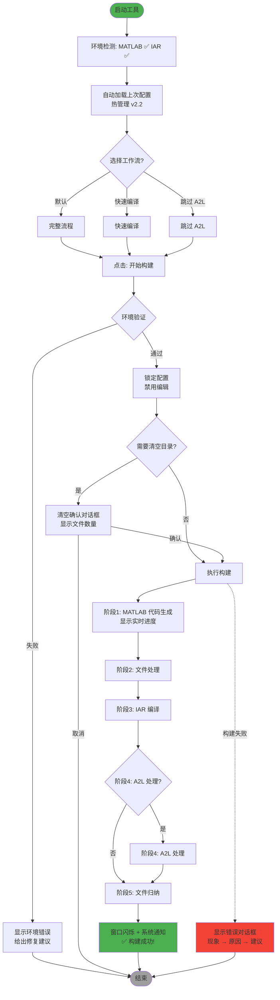
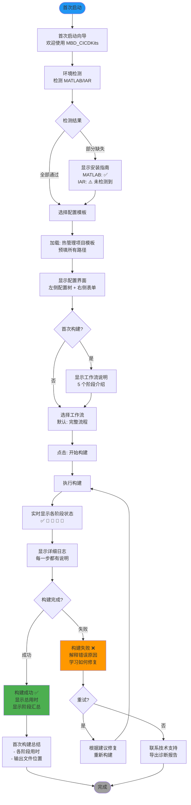

# UX Design Specification - MBD_CICDKits

**Author:** link
**Date:** 2026-02-03

---

## Executive Summary

### Project Vision

**MBD_CICDKits** 是一款面向嵌入式开发工程师的桌面自动化工具，专注于 Simulink 模型开发的 CI/CD 流程自动化。它将 **60 分钟的手动构建流程** 自动化为 **15 分钟的工具操作**，让工程师从重复性劳动中解放出来，专注于更有价值的创新工作。

**核心价值主张：**
- ⏱️ **效率提升**：从 60 分钟 → 15 分钟
- 🎯 **可靠性优先**：98% 成功率
- 🔧 **可操作的错误诊断**：清晰的问题定位
- 👥 **团队协作友好**：配置共享通过 Git 实现

**成功愿景：**
- **3 个月**：3-5 名工程师主动试用，有人主动分享给同事
- **6 个月**：60% 以上工程师日常使用，平均每次节省 30-40 分钟
- **12 个月**：成为新员工入职培训内容，手动操作错误减少 90%

**关键信号：** "这工具成功了" = 有人主动分享给同事说"试试这个工具"

---

### Target Users

#### 主要用户：日常工程师（小王）

**画像：**
- 角色：嵌入式开发工程师
- 场景：每周 2-3 次构建需求
- 痛点：45-60 分钟重复流程占用宝贵开发时间
- 期待："泡杯咖啡的功夫就搞定"

**需求：**
- 配置保存/快速加载
- 一键启动，无需全程紧盯
- 实时进度显示
- 成功通知

#### 次要用户：新员工（小李）

**画像：**
- 角色：刚入职的工程师
- 场景：首次学习构建流程
- 痛点：面对二十多页操作文档感到无助，需要 2 天培训
- 期待：通过工具界面"看懂"整个流程

**需求：**
- 配置模板库
- 详细步骤日志（学习辅助）
- 清晰的流程可视化
- 友好的错误引导

#### 支持用户：技术支持（老张）

**画像：**
- 角色：资深工程师/技术支持
- 场景：同事跑来说"工具挂了"
- 痛点：难以快速定位问题所在
- 期待：30 秒内给出诊断

**需求：**
- 结构化日志
- 可操作的错误信息
- 失败现场保留
- 环境检测报告

---

### Key Design Challenges

#### 挑战 1：进度透明度

**问题：**
- 15 分钟的等待期间，用户需要实时感知进度
- 5 个阶段的每个阶段都应可见其状态
- 长时间等待不能让用户感到"焦虑"

**UX 考虑：**
- 进度条 + 阶段列表双重展示
- 每个阶段显示执行时长
- 当前阶段的实时日志滚动
- 整体进度的百分比显示

#### 挑战 2：错误可操作性

**问题：**
- 当 MATLAB 或 IAR 失败时，错误信息通常很技术化
- 工程师可能不理解错误含义
- 需要将技术错误转化为可操作的修复建议

**UX 考虑：**
- 三层错误信息：现象 → 原因 → 建议
- 常见错误的预设解决方案
- 错误日志中的关键词高亮
- 失败配置的保存与重试机制

#### 挑战 3：学习曲线平滑

**问题：**
- 新员工需要通过 UI "学会"构建流程
- 复杂的 5 阶段流程需要直观表达
- 日志不仅仅是记录，更是学习工具

**UX 考虑：**
- 阶段图标 + 名称 + 状态的可视化
- 实时日志显示每一步在做什么
- 成功构建后的阶段时间汇总
- 首次使用时的配置向导

#### 挑战 4：配置管理复杂性

**问题：**
- 5 个阶段，多个路径配置
- 不同项目需要不同配置
- 团队配置共享需求

**UX 考虑：**
- 配置模板库
- 自动检测 MATLAB/IAR 路径
- 配置导入/导出
- Git 集成（Phase 2）

---

### Design Opportunities

#### 机会 1：构建即教学

**洞察：**
- 新员工通过看日志就能理解构建流程
- 实时进度展示让抽象的 5 阶段变得具体
- 成功构建本身就是最好的正向反馈

**设计方向：**
- 日志窗口 = 学习窗口
- 阶段状态 = 流程可视化
- 每个阶段的时长 = 性能认知

#### 机会 2：配置复用文化

**洞察：**
- "同事推荐的配置"比任何文档都有效
- Git 集成让好的配置自然传播
- 团队维护 3-5 个项目模板

**设计方向：**
- 配置模板库
- 从 Git 加载团队配置
- 配置分享链接
- 使用统计（识别热门配置）

#### 机会 3：情感化反馈

**洞察：**
- 成功通知 → "太爽了！"的满足感
- 错误诊断 → 从"挫败"到"知道怎么修"
- 进度可视化 → 从"等待焦虑"到"掌控感"

**设计方向：**
- 构建成功时的庆祝动画（克制）
- 错误时的同理心表达 + 可操作建议
- 进度条的颜色变化（等待 → 进行 → 完成）
- 窗口闪烁/系统托盘通知

#### 机会 4：专家模式渐进

**洞察：**
- 新手需要引导，专家需要效率
- 同一工具需要适应不同熟练度用户
- 从"自动"到"可配置"的渐进式功能

**设计方向：**
- MVP：固定 5 阶段流程
- Phase 2：启用/禁用阶段
- Phase 3：自定义工作流编辑器
- 始终保留"快速构建"一键模式

---

## Core User Experience

### Defining Experience

**核心用户行为：**

MBD_CICDKits 的核心行为是 **"一键构建"** —— 选择项目配置 → 点击"开始构建" → 15分钟后获得结果。

这是用户最常做的事情（每周 2-3 次），也是产品价值的核心体现。从 PRD 中小王的"Aha!"时刻可以感受到：

> "15分钟后，工具弹窗通知：'✅ 构建成功！文件已保存到 MBD_CICD_Obj_2026_02_03_10_30\'
> 小王的感受：'太爽了！刚才去泡咖啡的功夫就搞定了，而且文件命名规范、位置统一'"

如果这个体验不顺畅，整个产品就失败了。

---

### Platform Strategy

**平台决策：**

| 维度 | 决策 |
|------|------|
| **平台类型** | 桌面应用 |
| **操作系统** | Windows 10/11 (64位) |
| **交互方式** | 鼠标 + 键盘 |
| **离线运行** | 完全离线，无网络依赖 |
| **UI 框架** | PyQt6 |

**关键平台考虑：**
- PyQt6 提供原生 Windows 外观，用户无需学习新交互模式
- 信号槽机制支持实时进度更新，不阻塞 UI 线程
- 窗口可最小化到系统托盘，构建不干扰其他工作
- Windows 通知中心集成，构建完成即使窗口最小化也能感知

---

### Effortless Interactions

**哪些交互应该感觉"魔法般"自然？**

**1. 首次启动：环境检测通过**
- 工具启动时自动检测 MATLAB/IAR 环境
- 绿色 ✅ 标记表示"一切就绪"
- 红色 ⚠️ 标记表示"需要处理"，并给出具体建议
- **用户感受**："这个工具很专业，提前帮我检查好了"

**2. 配置加载**
- 启动时自动加载上次使用的配置
- 自动检测并填充 MATLAB/IAR 安装路径
- 配置模板一键应用

**3. 工作流模板一键切换**
- 4 种模板：完整流程 / 快速编译 / 跳过 A2L / 仅代码生成
- 下拉菜单选择，自动显示该模板包含的阶段
- 预计执行时间提示
- **用户感受**："我只需要这个功能，工具理解我"

**4. 构建启动**
- 一键启动，无需二次确认
- 自动验证环境（MATLAB/IAR 可用性）
- 锁定配置防止误修改

**5. 进度感知**
- 实时进度条自动更新
- 阶段状态可视化（等待 → 进行 → 完成）
- 日志窗口自动滚动到最新

**6. 清空目录确认**
- 清空前显示文件列表和数量
- 友好的警告提示
- "记住本次选择"选项
- **用户感受**："工具在保护我的数据"

**7. 完成通知**
- 窗口闪烁吸引注意
- 系统托盘图标提示
- 一键打开输出文件夹

---

### Critical Success Moments

**哪些时刻决定用户会说"这更好"？**

**时刻 0：首次启动 - 环境检测通过**
- 新用户首次打开工具
- 看到环境检测界面：MATLAB ✅ R2022b、IAR ✅ 9.3
- 感受："这个工具很专业，提前帮我检查好了"
- **建立第一层信任**

**时刻 1："Aha!" 体验（首次成功构建）**
- 新用户第一次点击"开始构建"
- 看到进度条自动推进，阶段状态变化
- 15分钟后收到"构建成功 ✅"
- 感受："这么简单？比看文档清楚多了！"

**时刻 2：日常效率（重复使用）**
- 打开工具，配置已加载
- 切换到"快速编译"工作流（只需 IAR 编译）
- 一键点击，去喝咖啡
- 回来后，文件已准备好
- 感受："省了 40 分钟，太爽了！"

**时刻 3：错误不挫败（故障处理）**
- 构建失败时，看到红色错误提示
- 点击查看详情，发现：
  ```
  ❌ 阶段3/5：IAR编译失败

  错误信息：Error[Li005]: no space in destination memory
  可能原因：代码量超出Flash容量
  建议操作：1.检查模型 2.优化代码 3.调整IAR配置
  ```
- 感受："原来这么回事，知道怎么修了"

**时刻 4：数据安全（清空确认）**
- 准备构建时，工具提示：
  ```
  ⚠️ 将清空目录：E:\projects\tms\src
  包含 127 个文件
  [确认] [取消]
  ```
- 用户感受到被尊重和保护
- 构建更安心

**时刻 5：团队协作（配置分享）**
- 同事说："用我的配置试试"
- 导入/加载配置，一键构建
- 成功！
- 感受："同事的配置真好用，我也要分享我的"

---

### Experience Principles

**指导所有 UX 设计决策的原则：**

**原则 1：一键即达**
- 核心行为（构建）最多点击一次
- 常用配置自动加载
- 环境验证自动执行
- 工作流模板一键切换

**原则 2：进度透明**
- 15 分钟等待 ≠ 焦虑等待
- 每个阶段可见、可感知
- 日志实时滚动，当前操作清晰
- 预计剩余时间提示

**原则 3：错误不挫败**
- 错误信息三层次：现象 → 原因 → 建议
- 从"不知道怎么办"到"知道下一步"
- 保留失败现场，支持快速重试

**原则 4：学习即使用**
- 界面本身就是流程文档
- 阶段可视化 = 流程可视化
- 新员工通过 UI 学会构建流程
- 日志窗口 = 学习窗口

**原则 5：稳定可信**
- 完全离线运行，不依赖网络
- 清空前确认，数据安全有保障
- 配置本地存储，团队通过 Git 共享
- 环境检测提前，问题早发现

---

## Desired Emotional Response

### Primary Emotional Goals

**主要情感目标：**

> **"掌控感 + 轻松感"** - 用户感觉完全掌控构建流程，15分钟等待变成轻松的咖啡时间

从用户旅程中的关键情感表达：
- 小王："**太爽了！** 刚才去泡咖啡的功夫就搞定了"
- 小李："**原来整个流程是这样的**，比看文档清楚多了"
- 老张："**从发现错误到给出诊断，只用了30秒**"

**情感转变路径：**
```
"我需要手动构建这个"（负担）
    ↓
"工具帮我构建了"（轻松）
    ↓
"我掌握了构建流程"（成长）
    ↓
"再也回不去手动了"（依赖）
```

---

### Emotional Journey Mapping

**用户在不同阶段的情感体验：**

| 阶段 | 期望情感 | 触发点 | 情感强度 |
|------|---------|--------|---------|
| **首次发现** | 好奇 + 期待 | 听说有个自动化工具 | ⭐⭐ |
| **首次启动** | 信任感建立 | 看到环境检测 ✅✅ | ⭐⭐⭐ |
| **首次构建** | "Aha!" 惊喜 | 15分钟搞定 + 界面清晰 | ⭐⭐⭐⭐⭐ |
| **日常使用** | 轻松 + 自信 | 配置已加载，一键搞定 | ⭐⭐⭐⭐ |
| **遇到错误** | 不挫败 + 有方向 | 错误信息清晰，有建议 | ⭐⭐⭐ |
| **再次使用** | 依赖 + 习惯 | "再也回不去手动了" | ⭐⭐⭐⭐⭐ |

**情感变化曲线：**
```
好奇 → 信任 → 惊喜 → 轻松 → 自信 → 依赖
 ↑       ↑       ↑       ↑       ↑       ↑
首次   环境    首次    日常     错误    长期
发现   检测    构建    使用     处理    使用
```

---

### Micro-Emotions

**细微但关键的情感状态：**

| 微情感对比 | 我们的选择 | 设计支持 |
|-----------|-----------|---------|
| **自信 vs 困惑** | ✅ 自信 | 清晰的界面、实时日志 |
| **信任 vs 怀疑** | ✅ 信任 | 环境提前检测、数据确认 |
| **轻松 vs 焦虑** | ✅ 轻松 | 进度透明、一键操作 |
| **掌控 vs 无助** | ✅ 掌控 | 可操作的错误建议 |
| **惊喜 vs 满意** | ✅ 惊喜 | 超出预期的效率提升 |
| **归属 vs 孤立** | ✅ 归属 | 配置分享、团队协作 |

**关键洞察：**
- 工程师群体重视**能力感**和**掌控感**
- 错误时的情感是关键转折点 - 从"挫败"到"有方向"
- 长期使用后应该形成**依赖**，"再也回不去手动"

---

### Design Implications

**如何通过 UX 设计实现这些情感？**

| 情感目标 | UX 设计方法 | 具体实现 |
|---------|------------|---------|
| **信任感** | • 首次启动：环境检测界面（绿色 ✅）<br>• 清空前：文件数量确认对话框 | 环境检测对话框、清空确认对话框 |
| **掌控感** | • 实时进度条 + 阶段状态<br>• 错误三层信息：现象 → 原因 → 建议<br>• 工作流模板一键切换 | 进度面板、错误详情面板、工作流选择器 |
| **轻松感** | • 一键启动（无需二次确认）<br>• 配置自动加载<br>• 进度条颜色变化 | 大按钮"开始构建"、配置自动恢复、进度条颜色 |
| **惊喜感** | • 构建成功时的窗口闪烁通知<br>• 阶段时间汇总（"才15分钟？"）<br>• 文件自动命名和组织 | 窗口闪烁、完成摘要、自动文件组织 |
| **归属感** | • 配置模板库（"同事推荐的配置"）<br>• 团队配置共享（Phase 2 Git 集成） | 配置管理界面、团队配置库（Phase 2） |

**需要避免的负面情感：**
| 负面情感 | 触发场景 | 避免方法 |
|---------|---------|---------|
| **困惑** | 不知道在做什么 | 实时日志、阶段名称清晰 |
| **焦虑** | 长时间等待无反馈 | 进度条、预计剩余时间 |
| **挫败** | 错误但不知道怎么修 | 可操作的修复建议 |
| **害怕** | 误删文件 | 清空前确认对话框 |

---

### Emotional Design Principles

**情感化设计指导原则：**

**原则 1：先建立信任，再提供服务**
- 首次启动时展示环境检测，建立专业形象
- 清空前确认，展现对用户的尊重
- 数据操作透明，让用户感到安全

**原则 2：让进度看得见，消除等待焦虑**
- 15 分钟等待期间，每秒都有反馈
- 进度条 + 阶段列表 + 实时日志 = 三重透明
- 颜色变化：等待（灰色）→ 进行（蓝色）→ 完成（绿色）

**原则 3：错误不是终点，是学习机会**
- 错误信息包含可操作的建议
- 保留失败现场，支持快速重试
- 从"不知道怎么办"到"知道下一步"

**原则 4：创造惊喜时刻，超出预期**
- 构建成功时的窗口闪烁通知
- 阶段时间汇总："总共 14 分 32 秒"
- 自动文件命名和组织："文件已准备好，位置：..."

**原则 5：培养归属感，促进团队协作**
- "同事推荐的配置"比任何文档都有效
- 配置模板库，团队智慧共享
- 从"我的工具"到"我们的工具"

---

## UX Pattern Analysis & Inspiration

### Inspiring Products Analysis

基于对目标用户（嵌入式开发工程师）日常工作环境的观察，我们分析了以下在工程领域广泛使用且备受好评的工具：

#### 1. IAR Embedded Workbench

**核心优势：**
- **左侧树状项目视图** - 清晰展示文件层级结构，工程师习惯的导航模式
- **绿色 ✓ 状态图标** - 编译成功/失败的即时视觉反馈
- **Build 按钮下拉菜单** - 提供 Make、Rebuild All、Clean 等快速操作
- **底部日志窗口** - 实时显示编译输出，自动滚动到最新
- **进度条 + 百分比** - 编译进度清晰可见，消除等待焦虑

**情感响应：**
- 信任感：编译前的环境检查建立专业形象
- 掌控感：实时日志让工程师知道每一步在做什么
- 轻松感：一键编译，无需重复点击

#### 2. Beyond Compare

**核心优势：**
- **左右对比视图** - 差异高亮，一目了然
- **颜色编码** - 红色表示删除，绿色表示新增，黄色表示修改
- **状态栏统计** - "已发现 3 处差异" 给出明确数字
- **合并操作简化** - 左键点击选择，右键菜单快速操作

**情感响应：**
- 清晰感：复杂差异变得简单可理解
- 效率感：批量合并操作节省大量时间

#### 3. 7-Zip

**核心优势：**
- **简洁的文件列表** - 清晰展示压缩包内容
- **提取路径确认** - 清空前提醒用户目标位置
- **进度条 + 剩余时间** - 精确的时间估算
- **"显示文件"按钮** - 清空前预览，避免误删

**情感响应：**
- 安全感：操作前确认，避免数据丢失
- 透明感：进度和剩余时间让等待不焦虑

#### 4. Git/TortoiseSVN

**核心优势：**
- **右键菜单集成** - 在文件浏览器中直接操作，无需打开工具
- **绿色/红色图标覆盖** - 文件状态一目了然
- **Commit 对话框** - 列出所有变更文件，勾选提交
- **冲突解决工具** - 三方对比，清晰标注冲突区域

**情感响应：**
- 归属感：团队协作的流畅体验
- 掌控感：版本控制完全透明

---

### Transferable UX Patterns

基于以上分析，我们提取出可迁移到 MBD_CICDKits 的 UX 模式：

#### 导航模式

**1. 左侧配置树视图**
- **来源**：IAR Embedded Workbench
- **应用场景**：项目配置管理界面
- **适配方式**：左侧显示配置项分类（MATLAB、IAR、路径、工作流），右侧显示详细配置
- **解决痛点**：配置项众多时的组织混乱问题

**2. 阶段状态列表**
- **来源**：IAR Build 输出、安装程序
- **应用场景**：构建进度面板
- **适配方式**：垂直列表显示 5 个阶段，每行显示：图标 + 名称 + 状态 + 耗时
- **解决痛点**：15 分钟等待期间的进度感知需求

#### 交互模式

**3. Build 按钮下拉菜单**
- **来源**：IAR Embedded Workbench、Visual Studio
- **应用场景**：工作流模板切换
- **适配方式**："开始构建"按钮下拉提供：完整流程、快速编译、跳过 A2L、仅代码生成
- **解决痛点**：不同场景下的快速模式切换

**4. 右键菜单快速操作**
- **来源**：TortoiseSVN、Windows 资源管理器
- **应用场景**：配置项操作、日志文件处理
- **适配方式**：配置项右键：复制路径、浏览文件夹、重置为默认
- **解决痛点**：常用操作的快捷访问

**5. 清空前确认对话框**
- **来源**：7-Zip、Windows 文件操作
- **应用场景**：清空 MATLAB 代码目录、IAR src 目录
- **适配方式**：显示 "将清空目录：xxx，包含 127 个文件"，[确认] [取消]
- **解决痛点**：误删文件的心理负担

#### 视觉模式

**6. 状态图标系统**
- **来源**：IAR、Windows 安装程序
- **应用场景**：环境检测、阶段状态
- **适配方式**：
  - ✅ 绿色 ✓ - 成功/就绪
  - 🔄 蓝色 ⟳ - 进行中
  - ❌ 红色 ✗ - 失败
  - ⚠️ 黄色 ⚠ - 警告
  - ⏸️ 灰色 - 等待/跳过
- **解决痛点**：状态的快速视觉识别

**7. 进度条 + 颜色变化**
- **来源**：IAR 编译、7-Zip 解压
- **应用场景**：整体构建进度、单个阶段进度
- **适配方式**：
  - 等待：灰色进度条
  - 进行中：蓝色进度条 + 百分比动画
  - 完成：绿色进度条
  - 失败：红色进度条
- **解决痛点**：长时间等待的焦虑感

**8. 三层错误信息展示**
- **来源**：Windows 安装程序失败对话框
- **应用场景**：构建失败诊断
- **适配方式**：
  - 标题：❌ 阶段3/5：IAR编译失败
  - 原始错误：Error[Li005]: no space in destination...
  - 可能原因：代码量超出Flash容量
  - 建议操作：1.检查模型 2.优化代码 3.调整IAR配置
- **解决痛点**：技术错误信息难理解、不知道如何修复

---

### Anti-Patterns to Avoid

基于对失败案例和用户抱怨的分析，以下模式应避免：

#### 交互反模式

**1. 过多的模态对话框**
- **问题**：每个操作都弹窗确认，打断工作流
- **用户抱怨**："点确定点到手软"
- **避免方法**：仅关键操作（清空目录）使用确认对话框，其他操作使用 Toast 通知或状态栏提示

**2. 纯 CLI 黑框界面**
- **问题**：需要记忆命令，新手友好度低
- **用户抱怨**："命令行参数太多记不住"
- **避免方法**：提供 GUI 界面，CLI 作为可选项（Phase 2）

**3. 错误信息无上下文**
- **问题**：只显示原始错误码，不解释含义
- **用户抱怨**："Error 1234 是什么意思？"
- **避免方法**：三层错误信息（现象 → 原因 → 建议）

**4. 配置保存路径隐藏**
- **问题**：不知道配置文件存在哪里
- **用户抱怨**："换电脑配置丢失了"
- **避免方法**：在配置管理界面显示配置文件路径，提供导出功能

#### 视觉反模式

**5. 进度条跳变**
- **问题**：进度从 30% 瞬间跳到 90%
- **用户抱怨**："这进度条不真实"
- **避免方法**：基于阶段平均时间计算百分比，平滑过渡

**6. 状态图标含义模糊**
- **问题**：黄色三角形既表示警告也表示进行中
- **用户抱怨**："这个黄色图标到底什么意思？"
- **避免方法**：明确的状态图标系统，避免一图多义

---

### Design Inspiration Strategy

基于以上分析，我们的设计灵感策略如下：

#### What to Adopt（直接采用）

**1. IAR 风格的左侧树视图 + 右侧详情面板**
- **理由**：工程师熟悉的导航模式，学习成本为零
- **应用**：配置管理界面

**2. 绿色 ✓ 状态图标系统**
- **理由**：通用的成功语义，无需解释
- **应用**：环境检测、阶段状态

**3. Build 按钮下拉菜单**
- **理由**：IAR 工程师已经习惯这种交互
- **应用**：工作流模板切换

**4. 进度条 + 百分比 + 颜色变化**
- **理由**：消除等待焦虑的最佳实践
- **应用**：构建进度面板

**5. 清空前确认对话框**
- **理由**：数据安全的基本保障
- **应用**：清空目录操作

#### What to Adapt（适配改进）

**1. 从 IAR 编译日志 → 结构化阶段日志**
- **原版**：纯文本编译输出
- **改进**：分阶段日志 + 关键词高亮 + 时间戳
- **理由**：新员工需要通过日志学习流程

**2. 从 TortoiseSVN 右键菜单 → 配置项右键菜单**
- **原版**：文件操作（Commit、Update、Revert）
- **改进**：配置操作（复制路径、浏览文件夹、重置默认、导出）
- **理由**：适配配置管理的特定场景

**3. 从 Beyond Compare 差异视图 → 构建前后对比**
- **原版**：两个文件/文件夹的差异对比
- **改进**：构建前的配置 vs 构建后的结果（Phase 2）
- **理由**：支持构建结果的快速验证

#### What to Avoid（避免采用）

**1. 过多的模态确认对话框**
- **替代方案**：Toast 通知、状态栏提示
- **理由**：减少点击次数，提升效率

**2. 纯命令行界面（MVP 阶段）**
- **替代方案**：PyQt6 GUI 界面
- **理由**：工程师用户需要直观的可视化反馈

**3. 原始错误信息直接展示**
- **替代方案**：三层错误信息（现象 → 原因 → 建议）
- **理由**：降低故障排查门槛，提升可操作性

---

### Implementation Priority

根据设计灵感策略，我们按优先级排序实施：

**P0（MVP 必须实现）：**
- 状态图标系统（✅/🔄/❌/⚠️）
- 进度条 + 颜色变化 + 百分比
- Build 按钮下拉菜单（工作流模板切换）
- 清空前确认对话框
- 三层错误信息展示

**P1（增强体验）：**
- 左侧树视图 + 右侧详情面板（配置管理）
- 分阶段日志 + 时间戳
- 右键菜单快速操作

**P2（Phase 2 功能）：**
- 构建前后对比视图
- 配置差异可视化
- CLI 界面作为可选项

---

## Design System Foundation

### Design System Choice

**选择：Qt 原生样式 + 自定义主题系统**

基于 MBD_CICDKits 的项目需求、目标用户和技术约束，我们选择 **Qt 原生样式 + QSS 自定义主题** 作为设计系统基础。

这个选择的核心思路是：
- 利用 PyQt6 内置的原生 Qt 组件（QTreeWidget、QProgressBar、QTableWidget 等）
- 通过 QSS（Qt Style Sheets）实现统一的视觉风格
- 自定义关键组件（进度面板、状态列表）的绘制
- 完全离线运行，无需任何外部 UI 库依赖

---

### Rationale for Selection

#### 1. 工程师友好的视觉语言

**决策依据：**

| 考虑因素 | 项目实际情况 | Qt原生样式契合度 |
|---------|------------|----------------|
| 目标用户 | 嵌入式开发工程师 | ✅ 工程师熟悉 Windows 原生外观 |
| 使用场景 | 与 IAR、Visual Studio 并行使用 | ✅ 视觉一致性，减少认知切换 |
| 学习成本 | 团队以技术背景为主 | ✅ 无需学习新的 UI 模式 |
| 情感目标 | 掌控感 + 轻松感（不追求花哨） | ✅ 原生外观传递专业和稳定感 |

**用户洞察：**
从 Step 5 的分析中，我们发现目标用户每天使用 IAR Embedded Workbench、Visual Studio 等工具，这些工具都采用传统的 Windows 原生外观。采用一致的视觉语言，可以：
- 降低学习成本（零学习曲线）
- 建立专业工具的形象（而非消费级应用）
- 传递稳定可信的感觉（与情感目标一致）

#### 2. 技术约束完美匹配

**决策依据：**

| 技术要求 | Qt原生样式满足情况 | 说明 |
|---------|------------------|------|
| 完全离线运行 | ✅ 完全满足 | PyQt6 内置，无外部依赖 |
| PyQt6 框架 | ✅ 原生支持 | Qt 设计了 PyQt6 |
| Windows 10/11 | ✅ 完美适配 | 自动适配系统主题 |
| 实时进度更新 | ✅ 信号槽机制 | 不阻塞 UI 线程 |
| 系统托盘集成 | ✅ 原生支持 | QSystemTrayIcon |

**技术风险：**
- **低风险**：使用 Qt 原生组件，无需担心第三方库的兼容性问题
- **易维护**：Qt 文档完善，社区支持强大
- **性能优异**：原生组件经过充分优化，内存占用低

#### 3. 开发效率与可控性平衡

**决策依据：**

| 维度 | Qt原生样式 | Fluent UI | 完全自定义 |
|------|-----------|-----------|-----------|
| 初始开发速度 | ⭐⭐⭐⭐⭐ | ⭐⭐⭐ | ⭐⭐ |
| 视觉独特性 | ⭐⭐⭐ | ⭐⭐⭐⭐⭐ | ⭐⭐⭐⭐⭐ |
| 维护成本 | ⭐⭐⭐⭐⭐ | ⭐⭐⭐ | ⭐⭐ |
| 离线友好 | ⭐⭐⭐⭐⭐ | ⭐⭐⭐ | ⭐⭐⭐⭐ |
| 学习曲线 | ⭐⭐⭐⭐⭐ | ⭐⭐⭐ | ⭐⭐ |

**综合评估：**
Qt 原生样式在**开发效率**和**可控性**之间达到了最佳平衡，特别适合：
- 小团队快速迭代
- 内部工具（无需商业级视觉独特性）
- 技术团队（无专业设计师）

#### 4. 长期可扩展性

**设计系统演进路径：**

```
MVP 阶段（Qt 原生）
    ↓
Phase 2（引入 QSS 主题系统）
    ↓
Phase 3（自定义组件库）
    ↓
Phase 4（可选：插件式主题支持）
```

**可扩展性考虑：**
- QSS 支持类似 CSS 的样式分离，后期可轻松换肤
- 自定义组件可逐步封装为可复用库
- 预留品牌元素插入点（Logo、主题色等）

---

### Implementation Approach

#### 阶段 1：核心布局与组件（MVP）

**目标：** 快速搭建可用的界面框架

**组件映射：**

| UI 需求 | Qt 组件 | 自定义需求 |
|---------|---------|-----------|
| 左侧配置树 | `QTreeWidget` | 无 |
| 右侧详情面板 | `QStackedWidget` + 表单控件 | 无 |
| 构建按钮下拉 | `QPushButton` + 菜单 | 无 |
| 进度条 | `QProgressBar` | 颜色变化逻辑 |
| 阶段状态列表 | `QListWidget` + 自定义 ItemDelegate | 图标 + 状态样式 |
| 日志窗口 | `QTextEdit`（只读） | 关键词高亮 |
| 状态栏 | `QStatusBar` | 无 |

**布局结构：**
```
QMainWindow
├── QMenuBar（菜单栏）
├── QToolBar（工具栏，可选）
├── QWidget（中央组件）
│   └── QHBoxLayout
│       ├── QTreeWidget（左侧配置树，30%宽度）
│       └── QStackedWidget（右侧详情面板，70%宽度）
└── QStatusBar（状态栏）
```

#### 阶段 2：QSS 主题系统

**目标：** 建立统一的视觉规范

**QSS 变量定义：**
```css
/* 颜色系统 */
--color-success: #4CAF50;    /* 绿色 - 成功 */
--color-progress: #2196F3;   /* 蓝色 - 进行中 */
--color-error: #F44336;      /* 红色 - 失败 */
--color-warning: #FF9800;    /* 黄色 - 警告 */
--color-idle: #9E9E9E;       /* 灰色 - 等待 */

/* 字体系统 */
--font-family: 'Microsoft YaHei UI', 'Segoe UI', sans-serif;
--font-size-base: 9pt;
--font-size-large: 11pt;
--font-size-small: 8pt;

/* 间距系统 */
--spacing-xs: 4px;
--spacing-sm: 8px;
--spacing-md: 16px;
--spacing-lg: 24px;
```

**组件样式示例：**
```css
/* 进度条颜色变化 */
QProgressBar::chunk:progress {
    background-color: var(--color-progress);
}

QProgressBar::chunk:error {
    background-color: var(--color-error);
}

QProgressBar::chunk:success {
    background-color: var(--color-success);
}
```

#### 阶段 3：自定义组件开发

**目标：** 实现独特的交互组件

**自定义组件清单：**

| 组件名称 | 功能描述 | 自定义方式 |
|---------|---------|-----------|
| `StageStatusList` | 阶段状态列表 | `QListWidget` + 自定义 `ItemDelegate` |
| `LogViewer` | 带高亮的日志查看器 | `QTextEdit` + 语法高亮逻辑 |
| `ConfigTree` | 配置管理树 | `QTreeWidget` + 右键菜单 |
| `ProgressCard` | 进度卡片组件 | `QWidget` 自定义绘制 |

**开发优先级：**
1. **P0**：`StageStatusList`、`LogViewer`（核心体验）
2. **P1**：`ConfigTree`（增强体验）
3. **P2**：`ProgressCard`（可选）

---

### Customization Strategy

#### 品牌元素融入

虽然采用 Qt 原生外观，但仍可通过有限的品牌元素建立识别度：

**可定制的品牌点：**
1. **应用图标** - 任务栏、窗口标题栏图标
2. **启动画面** - 简洁的启动页，显示 Logo 和版本
3. **主题色** - 在关键交互元素中使用品牌色（如按钮高亮）
4. **关于对话框** - 展示团队信息和贡献者

**克制的设计原则：**
- 不过度装饰，保持工具属性
- 品牌元素仅出现在非操作区域
- 避免使用大尺寸 Logo 或营销性文案

#### 主题切换支持（Phase 2）

**预留扩展点：**
```python
class ThemeManager:
    def __init__(self):
        self.themes = {
            'light': 'themes/light.qss',
            'dark': 'themes/dark.qss',  # Phase 2
            'custom': 'themes/custom.qss'  # 用户自定义
        }
        self.current_theme = 'light'

    def apply_theme(self, theme_name):
        qss_file = self.themes[theme_name]
        with open(qss_file, 'r', encoding='utf-8') as f:
            app.setStyleSheet(f.read())
```

**Phase 2 可选功能：**
- 暗色主题（Dark Mode）
- 高对比度主题（无障碍支持）
- 用户自定义主题（导入 QSS 文件）

#### 组件库沉淀

**长期演进策略：**

随着项目发展，将自定义组件沉淀为可复用的内部库：

```
mbd_cicd_kits/
├── core/              # 核心业务逻辑
├── ui/                # UI 层
│   ├── components/    # 自定义组件
│   │   ├── stage_status_list.py
│   │   ├── log_viewer.py
│   │   └── config_tree.py
│   ├── themes/        # QSS 主题文件
│   │   ├── light.qss
│   │   └── dark.qss
│   └── dialogs/       # 对话框
│       ├── env_check_dialog.py
│       └── clear_confirm_dialog.py
└── utils/             # 工具函数
```

**复用价值：**
- 团队后续项目的 UI 基础
- 减少 UI 开发的重复劳动
- 保持视觉一致性

---

### Success Metrics

**设计系统成功的标准：**

1. **开发效率** - MVP 版本在 X 周内完成（基于 Qt 原生组件）
2. **学习成本** - 新用户 5 分钟内理解界面布局
3. **性能指标** - 应用启动时间 < 3 秒，内存占用 < 100MB
4. **用户反馈** - Beta 测试用户满意度 > 4.0/5.0
5. **维护成本** - UI Bug 率 < 10%，主题切换无副作用

---

## Core Experience Mechanics

### 2.1 Defining Experience

**一句话描述：**

> **"一键构建，去喝咖啡，回来就搞定"**

这是用户会向同事描述 MBD_CICDKits 的方式。类似于那些著名产品的核心体验：
- 📱 Tinder: "Swipe to match with people"
- 📸 Snapchat: "Share photos that disappear"
- 🎵 Spotify: "Discover and play any song instantly"
- 🔧 **MBD_CICDKits: "一键构建，去喝咖啡，回来就搞定"**

**核心体验的本质：**

从 PRD 中小王的"Aha!"时刻可以完整感受到这个核心体验：

> "小王打开工具，选择项目配置，点击'开始构建'按钮，然后去泡咖啡。
> 15分钟后，工具弹窗通知：'✅ 构建成功！文件已保存到 MBD_CICD_Obj_2026_02_03_10_30\'
> 小王的感受：'太爽了！刚才去泡咖啡的功夫就搞定了，而且文件命名规范、位置统一'"

如果这个核心体验不顺畅，整个产品就失败了。

---

### 2.2 User Mental Model

#### 当前解决方案（手动流程）的心智模型

**用户当前的认知：**

| 阶段 | 用户行为 | 认知负担 |
|------|---------|---------|
| 1 | 打开 Simulink，加载模型 | 需要记忆操作步骤 |
| 2 | 配置代码生成参数 | 容易出错，担心配置错误 |
| 3 | 等待代码生成（5-10分钟） | 无进度反馈，焦虑等待 |
| 4 | 手动复制文件到指定目录 | 容易漏文件，需要仔细检查 |
| 5 | 打开 IAR，加载工程 | 需要手动操作，担心路径错误 |
| 6 | 配置编译选项 | 技术细节多，容易遗漏 |
| 7 | 等待编译（5-10分钟） | 无进度反馈，焦虑等待 |
| 8 | 手动处理 A2L 文件 | 技术操作复杂，需要查文档 |
| 9 | 整理输出文件 | 容易混乱，担心遗漏 |
| **总计** | **45-60 分钟** | **高认知负担 + 高焦虑** |

**当前心智模型：**
```
构建 = 复杂 + 多步骤 + 容易出错
     = 需要全程盯着
     = 成功 = 运气 + 技能
     = 一次耗时 45-60 分钟
```

#### 新工具的心智模型

**期望的认知转变：**

```
构建 = 一键 + 自动 + 可靠
     = 可以去做别的事
     = 成功 = 常态
     = 一次耗时 15 分钟
```

**认知转变的关键：**
1. **从复杂到简单** - 9 个步骤 → 1 个点击
2. **从焦虑到掌控** - 无反馈 → 实时进度
3. **从不确定到可靠** - 运气成分 → 98% 成功率
4. **从手动到自动** - 全程盯着 → 解放双手

---

### 2.3 Success Criteria

**什么让用户说"这很好用"？**

| 维度 | 成功标准 | 用户感受 | 成功信号 |
|------|---------|---------|---------|
| **速度** | 15分钟内完成 | "这么快？" | "才15分钟？" |
| **简单** | 最多点击 1 次 | "这么简单？" | "一键就搞定了" |
| **透明** | 每个阶段可见 | "我知道在做什么" | 不再需要一直盯着 |
| **可靠** | 98% 成功率 | "每次都能成功" | 信任工具，不再担心 |
| **反馈** | 完成时通知 | "我不用一直盯着" | 可以去做别的事 |

**定量成功指标：**

1. **首次体验成功** - 用户首次使用后说："太爽了，比手动快多了！"
2. **主动分享** - 用户主动向同事推荐："试试这个工具"
3. **持续使用** - 用户一周后仍在日常使用（证明有用）
4. **构建成功率** - 构建成功率 > 95%
5. **时间节省** - 每次构建节省 30-45 分钟

**定性成功信号：**

- 用户从"需要手动构建"（负担）→ "工具帮我构建"（轻松）→ "再也回不去手动了"（依赖）
- 用户从不知道构建流程 → 通过界面理解流程 → 能够向他人解释流程
- 用户从害怕构建失败 → 遇到错误知道怎么修复 → 信任工具的可靠性

---

### 2.4 Novel UX Patterns

**这是创新模式还是成熟模式？**

**结论：成熟模式的组合 + 微创新**

#### 成熟模式（直接采用）

| 模式 | 来源 | 采用方式 |
|------|------|---------|
| 进度条 + 阶段列表 | IAR / 安装程序 | ✅ 直接采用，用户熟悉 |
| 状态图标（✅/🔄/❌）| Windows / IAR | ✅ 直接采用，通用语义 |
| 一键启动 | 所有构建工具 | ✅ 直接采用，用户期望 |
| 工作流模板切换 | IDE（Debug/Release） | ✅ 直接采用，工程师习惯 |
| 确认对话框 | Windows / macOS | ✅ 直接采用，用户理解 |

#### 微创新（适配改进）

| 模式 | 创新点 | 创新程度 |
|------|-------|---------|
| 三层错误信息 | 从原始错误 → 现象+原因+建议 | 🔶 微创新 |
| 构建即教学 | 日志窗口 = 学习窗口 | 🔸 轻度创新 |
| 情感化反馈 | 进度颜色 + 窗口闪烁营造掌控感 | 🔸 轻度创新 |
| 15 分钟即走 | 离开通知系统 vs 必须一直盯着 | 🔸 轻度创新 |

#### 创新点详解

**1. 构建即教学（日志学习）**

**传统模式：** 日志 = 纯技术输出，只有专家能看懂

**我们的创新：** 日志 = 学习窗口，新员工通过日志学习流程

**实现方式：**
- 分阶段日志，每个阶段有清晰的标题
- 时间戳让用户感知进度
- 关键词高亮（成功/失败/警告）
- 构建完成后显示阶段时间汇总

**2. 错误不挫败（三层诊断）**

**传统模式：** 错误 = 技术错误码，不知道怎么办

**我们的创新：** 错误 = 学习机会，从挫败到有方向

**实现方式：**
```
❌ 阶段3/5：IAR编译失败

原始错误：Error[Li005]: no space in destination memory
可能原因：代码量超出Flash容量
建议操作：1.检查模型 2.优化代码 3.调整IAR配置
```

**3. 15 分钟即走（离开通知）**

**传统模式：** 必须一直盯着，害怕错过错误

**我们的创新：** 可以去做别的事，完成时通知

**实现方式：**
- 窗口闪烁吸引注意
- 系统托盘图标提示
- Windows 通知中心集成
- 构建完成即使窗口最小化也能感知

---

### 2.5 Experience Mechanics

#### 一键构建体验流程详解

**完整交互流程图：**

```
┌─────────────────────────────────────────────────────────────┐
│                      一键构建体验流程                          │
├─────────────────────────────────────────────────────────────┤
│                                                               │
│  【阶段 1：启动触发】                                          │
│     ┌─────────────────┐                                       │
│     │  [开始构建 ▼]   │  ← 下拉菜单选择工作流模板             │
│     │  ├─ 完整流程     │     (完整流程/快速编译/跳过A2L/仅代码生成)│
│     │  ├─ 快速编译     │                                       │
│     │  ├─ 跳过 A2L     │                                       │
│     │  └─ 仅代码生成   │                                       │
│     └─────────────────┘                                       │
│     点击后立即启动（无需二次确认）                              │
│                                                               │
│  【阶段 2：环境验证（自动，后台）】                              │
│     ✓ 检查 MATLAB 可用性                                       │
│     ✓ 检查 IAR 工程路径                                        │
│     ✓ 验证输出目录可写                                         │
│     如果失败 → 显示警告，建议修复方案                           │
│                                                               │
│  【阶段 3：进度展示】                                          │
│     ┌─────────────────────────────────────┐                   │
│     │ ████████░░░░░░░░░░░░░  40%        │  ← 整体进度条     │
│     │ 预计剩余: 8 分钟                   │                   │
│     └─────────────────────────────────────┘                   │
│                                                               │
│     ┌─────────────────────────────────────┐                   │
│     │ 🔄 1. MATLAB代码生成    3:45      │  ← 阶段列表       │
│     │ ⏸️ 2. 代码移动到IAR      0:00      │                   │
│     │ ⏸️ 3. IAR编译             0:00      │                   │
│     │ ⏸️ 4. A2L文件处理         0:00      │                   │
│     │ ⏸️ 5. 文件归纳整理        0:00      │                   │
│     └─────────────────────────────────────┘                   │
│                                                               │
│     当前阶段日志滚动：                                         │
│     ┌─────────────────────────────────────┐                   │
│     │ [10:32:15] 正在调用 genCode.m...     │                   │
│     │ [10:32:16] 模型加载完成             │                   │
│     │ [10:32:18] 代码生成中...           │                   │
│     │ [10:32:20] 生成文件: model.c       │                   │
│     │ [10:32:22] 生成文件: model.h       │                   │
│     └─────────────────────────────────────┘                   │
│                                                               │
│  【阶段 4：完成通知】                                          │
│     • 窗口闪烁吸引 attention                                    │
│     • 系统托盘图标提示                                          │
│     • 弹出通知：                                               │
│       ┌─────────────────────────────────────┐                   │
│       │  ✅ 构建成功！                      │                   │
│       │  总用时: 14 分 32 秒                │                   │
│       │  [打开文件夹]  [关闭]                │                   │
│       └─────────────────────────────────────┘                   │
│                                                               │
└─────────────────────────────────────────────────────────────┘
```

#### 错误处理体验流程

```
┌─────────────────────────────────────────────────────────────┐
│                      错误处理流程                              │
├─────────────────────────────────────────────────────────────┤
│                                                               │
│  当某个阶段失败时：                                            │
│                                                               │
│  【立即反馈】                                                  │
│     • 进度条变红色 ❌                                         │
│     • 失败阶段高亮显示                                         │
│     • 日志窗口滚动到错误位置                                   │
│     • 构建自动停止，保留现场                                   │
│                                                               │
│  【三层错误信息对话框】                                        │
│     ┌─────────────────────────────────────┐                   │
│     │  ❌ 阶段3/5：IAR编译失败            │                   │
│     ├─────────────────────────────────────┤                   │
│     │  原始错误:                         │                   │
│     │  Error[Li005]: no space in        │                   │
│     │  destination memory                │                   │
│     ├─────────────────────────────────────┤                   │
│     │  可能原因:                         │                   │
│     │  代码量超出Flash容量                │                   │
│     ├─────────────────────────────────────┤                   │
│     │  建议操作:                         │                   │
│     │  1. 检查Simulink模型配置            │                   │
│     │  2. 优化代码生成选项                │                   │
│     │  3. 调整IAR链接器配置              │                   │
│     ├─────────────────────────────────────┤                   │
│     │  [查看详细日志]  [重试]  [关闭]     │                   │
│     └─────────────────────────────────────┘                   │
│                                                               │
│  【保留失败现场】                                              │
│     • 配置保持不变                                             │
│     • 日志完整保存                                             │
│     • 支持一键重试                                             │
│     • 导出错误报告（Phase 2）                                  │
│                                                               │
└─────────────────────────────────────────────────────────────┘
```

#### 清空目录确认体验

```
┌─────────────────────────────────────────────────────────────┐
│                   清空目录确认流程                            │
├─────────────────────────────────────────────────────────────┤
│                                                               │
│  当需要清空目录时：                                            │
│                                                               │
│     ┌─────────────────────────────────────┐                   │
│     │  ⚠️ 确认清空目录                     │                   │
│     ├─────────────────────────────────────┤                   │
│     │  将清空目录:                       │                   │
│     │  E:\projects\tms\20_Code           │                   │
│     ├─────────────────────────────────────┤                   │
│     │  包含 127 个文件                    │                   │
│     │                                   │                   │
│     │  ☐ 记住本次选择，不再确认            │                   │
│     ├─────────────────────────────────────┤                   │
│     │  [确认]  [取消]                     │                   │
│     └─────────────────────────────────────┘                   │
│                                                               │
│  用户感受到被尊重和保护，构建更安心                             │
│                                                               │
└─────────────────────────────────────────────────────────────┘
```

---

## Visual Design Foundation

### Color System

**设计理念：**
- 参考工程师日常工具（IAR、Visual Studio）的配色习惯
- 状态颜色清晰可辨，符合工程师的认知模式
- 保持克制，避免花哨的装饰元素

**主色调方案：**

| 颜色类别 | 色值 (HEX) | 用途说明 |
|---------|-----------|---------|
| **主色调** | `#0078D4` | Windows 系统蓝 - 按钮、链接、选中状态 |
| **辅助色** | `#6C757D` | 次要文本、边框、分隔线 |
| **背景色** | `#FFFFFF` | 主背景、对话框背景 |
| **次要背景** | `#F5F5F5` | 面板背景、分组区域 |
| **文本主色** | `#212529` | 主要文本内容 |
| **文本次色** | `#6C757D` | 次要文本、提示信息 |

**状态颜色系统：**

| 状态 | 色值 (HEX) | 图标 | 用途 |
|------|-----------|------|------|
| **成功** | `#4CAF50` | ✅ | 构建成功、阶段完成、环境检测通过 |
| **进行中** | `#2196F3` | 🔄 | 阶段执行中、进度条 |
| **失败** | `#F44336` | ❌ | 构建失败、错误提示 |
| **警告** | `#FF9800` | ⚠️ | 警告信息、需要注意的问题 |
| **等待** | `#9E9E9E` | ⏸️ | 阶段等待、跳过的阶段 |

**无障碍考虑：**
- 所有文本与背景的对比度符合 WCAG AA 标准（4.5:1）
- 状态颜色同时配合图标使用，确保色盲用户也能识别

---

### Typography System

**设计理念：**
- 使用 Windows 原生字体，零学习成本
- 技术背景用户对等宽字体有亲切感
- 清晰的层级支持信息扫描

**字体家族：**

| 用途 | 字体 | 说明 |
|------|------|------|
| **界面主体** | `'Microsoft YaHei UI', 'Segoe UI', sans-serif` | Windows 原生，中文优化 |
| **日志/代码** | `'Consolas', 'Courier New', monospace` | 等宽字体，便于阅读技术输出 |
| **数字/数据** | `'Segoe UI', 'Tahoma', sans-serif` | 数字显示优化 |

**字体层级：**

| 级别 | 大小 | 字重 | 用途 |
|------|------|------|------|
| **H1 - 标题** | 18pt | Semibold 600 | 窗口主标题 |
| **H2 - 分组标题** | 11pt | Bold 700 | 面板标题、分组标题 |
| **H3 - 子标题** | 10pt | Semibold 600 | 配置项标题 |
| **Body - 正文** | 9pt | Regular 400 | 常规文本内容 |
| **Small - 辅助** | 8pt | Regular 400 | 提示信息、标签 |
| **Log - 日志** | 9pt | Regular 400 | 日志输出（等宽） |

**行高与间距：**
- 标题行高：1.3
- 正文行高：1.5
- 日志行高：1.2（等宽字体紧凑排列）

---

### Spacing & Layout Foundation

**设计理念：**
- 参考传统 Windows 工具的密度习惯
- 使用 8px 基础网格系统
- 保持界面紧凑但不拥挤

**间距单位系统：**

| 单位 | 值 | 用途 |
|------|-----|------|
| **xs** | 4px | 图标与文字间距、小元素内边距 |
| **sm** | 8px | 相关元素间距、输入框内边距 |
| **md** | 16px | 分组间距、面板内边距 |
| **lg** | 24px | 主要区域间距 |
| **xl** | 32px | 页面级边距 |

**网格系统：**

```
主窗口布局（建议）：
┌─────────────────────────────────────────────────────┐
│  xl=32  ┌──────────────┐  md=16  ┌───────────────┐ │
│  (边距)  │              │         │               │ │
│         │  左侧配置树   │         │  右侧详情面板  │ │
│         │  (30% 宽度)   │         │  (70% 宽度)   │ │
│         │  sm=8 内边距  │         │  md=16 内边距 │ │
│         │              │         │               │ │
└─────────┴──────────────┴─────────┴───────────────┘
```

**组件间距规则：**
- 按钮组内按钮间距：`sm (8px)`
- 表单字段间距：`sm (8px)`
- 面板之间间距：`md (16px)`
- 主要区域边距：`xl (32px)`

**内边距标准：**
- 对话框：`lg (24px)`
- 面板/分组：`md (16px)`
- 输入框：`sm (8px)` 垂直，`md (16px)` 水平

---

### Accessibility Considerations

**无障碍设计考虑：**

1. **颜色对比度** - 所有文本与背景对比度 ≥ 4.5:1（WCAG AA 标准）
2. **双重编码** - 状态同时使用颜色 + 图标表示，支持色盲用户
3. **键盘导航** - 所有交互元素支持键盘访问（Tab 键导航）
4. **焦点可见** - 焦点状态有明显的视觉指示
5. **字体可缩放** - 支持 Windows 系统缩放设置（125%、150%）

---

### Visual Consistency Principles

**视觉一致性原则：**

1. **工程师友好** - 界面密度和交互模式符合工程师对传统工具的预期

2. **状态一目了然** - 颜色 + 图标双重编码，确保状态识别零歧义

3. **信息层级清晰** - 通过字体大小、颜色深浅、间距大小建立视觉层级

4. **原生外观优先** - 利用 PyQt6 的 Qt 原生组件，保持与 Windows 系统的一致性

5. **克制使用强调色** - 仅在关键交互元素（按钮、链接）使用主色调

---

## Design Direction Decision

### Design Directions Explored

我们探索了 4 个不同的设计方向，每个方向都有其独特的价值主张：

| 方向 | 特点 | 目标用户 |
|------|------|---------|
| **A：经典工程师工具** | IAR/VS 风格、高密度、双栏布局 | 日常工程师、技术支持 |
| **B：现代简洁风格** | 大间距、清晰层级、现代化 | 新员工、注重 UX 的团队 |
| **C：流程可视化风格** | 流程图展示、阶段可视化 | 新员工学习、流程演示 |
| **D：配置中心风格** | 配置管理优先、快速切换 | 多项目管理场景 |

### Chosen Direction

**方向 A：经典工程师工具风格** 🔧

**核心特征：**
- 完全参考 IAR Embedded Workbench 和 Visual Studio 的经典布局
- 左侧树状配置视图（30% 宽度）+ 右侧详情面板（70% 宽度）的双栏布局
- 高密度信息展示，最大化屏幕空间利用
- 传统的 Windows 工具外观，零学习成本

**布局结构：**
```
┌────────────────────────────────────────────────────────────┐
│  MBD_CICDKits                                    [- □ ×]    │
├────────────────────────────────────────────────────────────┤
│  [热管理项目 ▼]  [编辑] [删除]    [完整流程 ▼] [开始构建] │
├─────────────┬──────────────────────────────────────────────┤
│  📁 配置树   │  ┌─ 项目配置 ───────────────────────────┐  │
│             │  │  Simulink 工程路径: [____] [浏览]    │  │
│  ├─ 项目配置 │  │  MATLAB 代码路径: [____] [浏览]     │  │
│  ├─ 工作流   │  │  IAR 工程路径: [____] [浏览]        │  │
│  └─ 历史    │  └──────────────────────────────────────┘  │
│             │  ┌─ 构建进度 ───────────────────────────┐  │
│             │  │  ████████░░░░  60%                   │  │
│             │  │  ✅ MATLAB代码生成 (2:15)           │  │
│             │  │  🔄 IAR编译... (进行中)              │  │
│             │  └──────────────────────────────────────┘  │
│             │  ┌─ 实时日志 ───────────────────────────┐  │
│             │  │  [10:30:15] 开始构建...              │  │
│             │  │  [10:32:30] 代码生成完成 ✅          │  │
│             │  └──────────────────────────────────────┘  │
└─────────────┴──────────────────────────────────────────────┘
```

**关键组件映射：**

| 位置 | 组件 | 说明 |
|------|------|------|
| **顶部工具栏** | 项目选择器、工作流选择器、构建按钮 | 快速访问核心功能 |
| **左侧配置树** | QTreeWidget | 项目配置的层级组织 |
| **右侧上部** | 项目配置表单 | 路径输入、浏览按钮 |
| **右侧中部** | 进度面板 | 进度条 + 阶段状态列表 |
| **右侧下部** | 日志查看器 | QTextEdit + 关键词高亮 |

### Design Rationale

**选择方向 A 的理由：**

1. **零学习成本** - 工程师每天都在使用 IAR、Visual Studio 等类似布局的工具，无需重新学习

2. **符合情感目标** - "掌控感 + 轻松感" 的情感目标通过熟悉的界面自然实现

3. **高效空间利用** - 高密度布局让用户在一个屏幕上看到更多信息，减少滚动操作

4. **Qt 原生样式契合** - PyQt6 的 QTreeWidget、QTableWidget 等组件正是为此类布局设计

5. **支持三类用户** - 日常工程师（效率）、新员工（熟悉环境）、技术支持（快速定位问题）

6. **与架构决策一致** - 支持架构文档中的 "混合架构模式"（UI 层用类、业务层用函数）

### Implementation Approach

**实施方法：**

**阶段 1：核心布局（P0 - MVP）**
- 创建 MainWindow 主窗口框架
- 实现 QHBoxLayout 左右分栏（30% : 70%）
- 左侧 QTreeWidget 配置树
- 右侧 QStackedWidget 详情面板（配置、进度、日志）

**阶段 2：配置管理（P0 - MVP）**
- 实现配置表单界面（路径输入 + 浏览按钮）
- 配置加载/保存功能
- 配置验证逻辑

**阶段 3：构建监控（P0 - MVP）**
- 进度条组件（QProgressBar + 颜色变化）
- 阶段状态列表（QListWidget + 自定义 ItemDelegate）
- 日志查看器（QTextEdit + 关键词高亮）

**阶段 4：交互完善（P1 - Phase 2）**
- 工作流模板下拉菜单
- 清空目录确认对话框
- 环境检测对话框
- 完成通知（窗口闪烁）

**关键实现细节：**

```python
# 主窗口布局示例
class MainWindow(QMainWindow):
    def __init__(self):
        super().__init__()

        # 中央组件 - 水平布局
        central_widget = QWidget()
        self.setCentralWidget(central_widget)
        main_layout = QHBoxLayout(central_widget)
        main_layout.setContentsMargins(32, 16, 32, 16)  # xl, xl, xl, lg

        # 左侧配置树 (30%)
        self.config_tree = QTreeWidget()
        self.config_tree.setMaximumWidth(300)
        main_layout.addWidget(self.config_tree, 30)

        # 右侧详情面板 (70%)
        self.detail_panel = QStackedWidget()
        main_layout.addWidget(self.detail_panel, 70)
```

**样式应用：**

```css
/* QSS 示例 - 应用视觉基础 */
QTreeWidget {
    font: 9pt 'Microsoft YaHei UI';
    background-color: #FFFFFF;
    border: 1px solid #6C757D;
}

QPushButton {
    background-color: #0078D4;
    color: #FFFFFF;
    border: none;
    padding: 8px 16px;
    font: 9pt 'Microsoft YaHei UI';
}

QPushButton:hover {
    background-color: #005A9E;
}
```

---

## User Journey Flows

### Journey 1: 工程师小王 - 日常成功路径

**旅程目标：** 从打开工具到成功构建，最少点击次数，最短时间内完成

**流程图：**



**关键设计点：**

| 设计点 | 实现 |
|--------|------|
| **最少点击** | 默认工作流 + 一键构建 = 1 次点击 |
| **配置自动加载** | 启动时自动加载上次使用的配置 |
| **进度透明** | 5 阶段状态实时显示，每个阶段可见耗时 |
| **错误不挫败** | 三层错误信息（现象 → 原因 → 建议） |
| **可离开** | 构建过程中可最小化窗口，完成时通知 |

---

### Journey 2: 新员工小李 - 首次使用学习

**旅程目标：** 通过界面理解构建流程，30 分钟内完成首次构建

**流程图：**



**关键设计点：**

| 设计点 | 实现 |
|------|------|
| **配置模板** | 提供"热管理项目模板"，新员工无需手动填写 |
| **流程可视化** | 5 阶段状态可视化，新员工"看懂"流程 |
| **日志即学习** | 详细日志说明每一步在做什么 |
| **错误即教学** | 错误信息包含学习链接和修复建议 |
| **首次构建总结** | 显示阶段汇总，帮助理解各阶段作用 |

---

### Journey 3: 技术支持老张 - 故障排查

**旅程目标：** 30 秒内定位问题，给出可操作的修复建议

**流程图：**

```mermaid
flowchart TD
    Start([同事报告问题]) --> OpenTool[打开 MBD_CICDKits]
    OpenTool --> LoadFailedConfig[加载失败配置<br/>或重现问题]

    LoadFailedConfig --> ShowErrorUI[显示错误界面<br/>❌ 阶段3/5: IAR编译失败]
    ShowErrorUI --> ErrorDetails[查看详细错误信息]

    ErrorDetails --> ThreeLayer[三层错误信息:<br/>━━━━━━━━━━━━━━━<br/>❌ 现象: IAR编译失败<br/>📋 原因: Error[Li005]<br/>💡 建议: 1.检查模型 2.优化代码 3.调整IAR配置]

    ThreeLayer --> ViewLog{查看日志?}
    ViewLog -->|是| ShowLogDetail[显示错误位置<br/>日志高亮显示<br/>自动滚动到错误处]
    ViewLog -->|否| Diagnose

    ShowLogDetail --> Diagnose{快速诊断}

    Diagnose --> CommonError{常见错误?}
    CommonError -->|是| ShowSolution[显示预设解决方案<br/>Flash 容量不足 → 优化模型配置]
    CommonError -->|否| GenerateReport[生成环境检测报告<br/>导出完整日志]

    ShowSolution --> ApplyFix{应用修复?}
    ApplyFix -->|是| ApplyAndRetry[应用修复并重试<br/>保持配置]
    ApplyFix -->|否| ManualFix[手动修复后重试]

    ApplyAndRetry --> RetryBuild[重新构建]
    ManualFix --> RetryBuild

    GenerateReport --> ShareReport[分享诊断报告<br/>通过邮件/聊天工具]
    ShareReport --> End([完成])

    RetryBuild --> Success{成功?}
    Success -->|是| ShowSuccess[✅ 问题已解决<br/>记录解决方案]
    Success -->|否| DeepDiagnose[深度诊断<br/>收集更多信息]

    ShowSuccess --> End
    DeepDiagnose --> ContactVendor[联系工具供应商<br/>提交 Bug 报告]
    ContactVendor --> End

    style Start fill:#FF9800
    style End fill:#9E9E9E
    style ShowErrorUI fill:#F44336
    style ShowSuccess fill:#4CAF50
```

**关键设计点：**

| 设计点 | 实现 |
|------|------|
| **快速定位** | 错误界面直接显示失败阶段 |
| **三层诊断** | 现象 → 原因 → 建议的标准格式 |
| **常见错误库** | 预设常见错误的解决方案 |
| **日志高亮** | ERROR 关键词高亮，自动滚动到错误处 |
| **诊断报告** | 一键生成环境检测报告，便于分享 |

---

### Journey Patterns

从以上 3 个旅程中，我们提取出以下可复用的设计模式：

#### 导航模式

| 模式 | 说明 | 应用场景 |
|------|------|---------|
| **快速启动模式** | 自动加载上次配置 + 默认工作流 | 日常构建（旅程 1） |
| **模板引导模式** | 配置模板 + 向导式说明 | 首次使用（旅程 2） |
| **诊断驱动模式** | 错误界面 + 三层信息 + 可操作建议 | 故障排查（旅程 3） |

#### 决策模式

| 模式 | 说明 | 应用场景 |
|------|------|---------|
| **确认-取消模式** | 危险操作前确认（清空目录） | 所有旅程 |
| **重试-放弃模式** | 失败后提供重试或退出选项 | 构建失败 |
| **模板-自定义模式** | 提供模板但允许自定义 | 首次配置 |

#### 反馈模式

| 模式 | 说明 | 应用场景 |
|------|------|---------|
| **实时进度模式** | 进度条 + 阶段状态 + 实时日志 | 构建执行中 |
| **完成通知模式** | 窗口闪烁 + 系统通知 + 汇总信息 | 构建成功 |
| **三层错误模式** | 现象 → 原因 → 建议 | 所有错误场景 |

---

### Flow Optimization Principles

基于以上旅程设计，我们建立以下优化原则：

1. **最小化点击原则** - 核心行为（构建）最多 1 次点击
2. **默认值智能原则** - 自动加载合理的默认配置
3. **进度透明原则** - 每个阶段可见、可感知
4. **错误可操作原则** - 错误信息包含可操作的修复建议
5. **学习即使用原则** - 界面本身就是流程文档

---

## Component Strategy

### Design System Components

**Qt 原生组件（PyQt6 提供）：**

| Qt 组件 | 用途 | 状态 |
|---------|------|------|
| `QTreeWidget` | 左侧配置树 | ✅ 可直接使用 |
| `QComboBox` | 下拉选择器（项目、工作流） | ✅ 可直接使用 |
| `QPushButton` | 按钮（构建、浏览、编辑） | ✅ 可直接使用 |
| `QLineEdit` | 文本输入框（路径） | ✅ 可直接使用 |
| `QProgressBar` | 进度条 | ✅ 可直接使用 |
| `QTextEdit` | 日志查看器 | ✅ 可直接使用 |
| `QLabel` | 标签、提示信息 | ✅ 可直接使用 |
| `QCheckBox` | 复选框 | ✅ 可直接使用 |
| `QMainWindow` | 主窗口框架 | ✅ 可直接使用 |
| `QDialog` | 对话框基类 | ✅ 可直接使用 |

---

### Custom Components

#### 组件 1：阶段状态列表（StageStatusList）

**用途：** 在构建过程中显示 5 个阶段的实时状态

**规格说明：**

| 属性 | 说明 |
|------|------|
| **Purpose** | 让用户实时感知 5 阶段构建进度 |
| **Content** | 阶段名称 + 状态图标 + 执行时长 |
| **Actions** | 点击阶段查看详细日志 |
| **States** | 等待/进行中/已完成/失败 |
| **Accessibility** | 键盘导航 + 屏幕阅读器支持 |

**视觉结构：**
```
┌─ 阶段状态 ────────────────────────┐
│  🔄 1. MATLAB代码生成    3:45     │  ← 进行中
│  ✅ 2. 文件移动到IAR      1:20     │  ← 已完成
│  ⏸️ 3. IAR编译             0:00     │  ← 等待
│  ⏸️ 4. A2L文件处理         0:00     │  ← 等待
│  ⏸️ 5. 文件归纳整理        0:00     │  ← 等待
└────────────────────────────────────┘
```

**实现要点：**
- 基于 `QListWidget` + 自定义 `ItemDelegate`
- 使用 `QStyledItemDelegate` 绘制图标 + 时间
- 状态颜色映射（等待：灰色、进行中：蓝色、完成：绿色、失败：红色）

---

#### 组件 2：日志查看器（LogViewer）

**用途：** 显示构建过程的实时日志输出

**规格说明：**

| 属性 | 说明 |
|------|------|
| **Purpose** | 实时显示构建日志，高亮关键词 |
| **Content** | 时间戳 + 日志级别 + 日志内容 |
| **Actions** | 搜索、过滤、复制、自动滚动 |
| **States** | 默认、高亮模式、搜索模式 |
| **Accessibility** | 键盘导航 + 高对比度支持 |

**视觉结构：**
```
┌─ 实时日志 ────────────────────────┐
│  [🔍 搜索...]  [ERROR] [WARNING]  │  ← 工具栏
│  ┌─────────────────────────────┐  │
│  │ [10:30:15] 开始构建...        │  │
│  │ [10:32:30] 代码生成完成 ✅    │  │
│  │ [10:32:45] [ERROR] 编译失败   │  │  ← ERROR 高亮
│  │ [10:33:00] [WARN] 内存不足    │  │  ← WARN 高亮
│  └─────────────────────────────┘  │
└────────────────────────────────────┘
```

**实现要点：**
- 基于 `QTextEdit`（只读模式）
- 使用 `QTextCharFormat` 实现关键词高亮
- 使用 `QTimer` 实现自动滚动到最新
- 限制最大行数（10,000 行）防止内存溢出

---

#### 组件 3：环境检测面板（EnvCheckPanel）

**用途：** 启动时显示 MATLAB/IAR 环境检测结果

**规格说明：**

| 属性 | 说明 |
|------|------|
| **Purpose** | 显示环境检测结果，提供修复建议 |
| **Content** | 检测项名称 + 状态图标 + 详细信息 |
| **Actions** | 重新检测、查看详情、复制报告 |
| **States** | 检测中/检测完成/部分失败 |
| **Accessibility** | 键盘导航 + 屏幕阅读器支持 |

**视觉结构：**
```
┌─ 环境检测 ────────────────────────┐
│  MATLAB Engine API                │
│  ✅ 已安装 R2022b                  │
│  路径: C:\Program Files\MATLAB\... │
│                                    │
│  IAR Embedded Workbench            │
│  ✅ 已安装 9.3                     │
│  路径: C:\Program Files\IAR\...    │
│                                    │
│  [重新检测]  [复制报告]  [关闭]   │
└────────────────────────────────────┘
```

---

#### 组件 4：清空确认对话框（ClearConfirmDialog）

**用途：** 清空目录前显示文件数量，请求用户确认

**规格说明：**

| 属性 | 说明 |
|------|------|
| **Purpose** | 防止误删文件，提供透明的信息 |
| **Content** | 目录路径 + 文件数量 + 文件列表预览 |
| **Actions** | 确认、取消、查看详细列表 |
| **States** | 默认、记住选择状态 |
| **Accessibility** | 键盘导航 + 屏幕阅读器支持 |

**视觉结构：**
```
┌─ 确认清空目录 ────────────────────┐
│                                    │
│  ⚠️  将清空目录:                   │
│  E:\projects\tms\20_Code           │
│                                    │
│  包含 127 个文件                    │
│                                    │
│  ☐ 记住本次选择，不再确认            │
│                                    │
│  [确认]  [取消]                     │
└────────────────────────────────────┘
```

---

#### 组件 5：进度面板（ProgressPanel）

**用途：** 组合进度条 + 阶段列表，提供完整的进度可视化

**规格说明：**

| 属性 | 说明 |
|------|------|
| **Purpose** | 提供完整的构建进度可视化 |
| **Content** | 进度条 + 预计剩余时间 + 阶段状态列表 |
| **Actions** | 点击阶段查看详情 |
| **States** | 等待、进行中、完成、失败 |
| **Accessibility** | 键盘导航 + 屏幕阅读器支持 |

**视觉结构：**
```
┌─ 构建进度 ────────────────────────┐
│  ████████░░░░░░░░░░░░░░░  40%    │  ← 进度条
│  预计剩余: 9 分钟                   │
│                                    │
│  ✅ MATLAB代码生成    3:45         │
│  🔄 IAR编译          进行中...      │
│  ⏸️ A2L文件处理       等待中        │
│  ⏸️ 文件归纳整理      等待中        │
└────────────────────────────────────┘
```

---

#### 组件 6：错误诊断面板（ErrorDiagnosisPanel）

**用途：** 构建失败时显示三层错误信息

**规格说明：**

| 属性 | 说明 |
|------|------|
| **Purpose** | 提供可操作的错误诊断信息 |
| **Content** | 现象 + 原因 + 建议 + 相关日志 |
| **Actions** | 查看详细日志、重新构建、导出报告 |
| **States** | 默认、展开详情 |
| **Accessibility** | 键盘导航 + 屏幕阅读器支持 |

**视觉结构：**
```
┌─ 构建失败 ────────────────────────┐
│  ❌ 阶段3/5：IAR编译失败          │
│  ━━━━━━━━━━━━━━━━━━━━━━━━━━━━━━  │
│  错误信息:                         │
│  Error[Li005]: no space in        │
│  destination memory               │
│                                    │
│  可能原因:                         │
│  代码量超出Flash容量                │
│                                    │
│  建议操作:                         │
│  1. 检查Simulink模型配置            │
│  2. 优化代码生成选项                │
│  3. 调整IAR链接器配置               │
│                                    │
│  [查看详细日志]  [重试]  [关闭]    │
└────────────────────────────────────┘
```

---

### Component Implementation Strategy

**基础组件（Qt 原生）：**
- 直接使用 PyQt6 提供的原生组件
- 通过 QSS 统一视觉风格
- 确保无障碍支持（键盘导航、焦点可见）

**自定义组件：**

| 组件 | 基类 | 自定义方式 | 复杂度 |
|------|------|-----------|--------|
| StageStatusList | QListWidget | 自定义 ItemDelegate | 中 |
| LogViewer | QTextEdit | 关键词高亮逻辑 | 中 |
| EnvCheckPanel | QWidget | 组合布局 | 低 |
| ClearConfirmDialog | QDialog | 定制布局 | 低 |
| ProgressPanel | QWidget | 组合布局 | 低 |
| ErrorDiagnosisPanel | QWidget | 定制布局 | 中 |

**实施原则：**
1. **复用优先** - 优先使用 Qt 原生组件
2. **渐进自定义** - 从简单自定义组件开始，逐步积累组件库
3. **保持一致性** - 所有组件遵循视觉基础（颜色、字体、间距）
4. **无障碍优先** - 所有组件支持键盘导航和屏幕阅读器

---

### Implementation Roadmap

**Phase 1 - 核心组件（P0 - MVP）：**

| 组件 | 原因 | 优先级 |
|------|------|--------|
| LogViewer | 支持所有旅程的日志查看 | 🔴 最高 |
| StageStatusList | 核心体验必需 | 🔴 最高 |
| EnvCheckPanel | 启动必需 | 🟡 高 |
| ClearConfirmDialog | 数据安全必需 | 🟡 高 |

**Phase 2 - 增强组件（P1 - Phase 2）：**

| 组件 | 原因 | 优先级 |
|------|------|--------|
| ProgressPanel | 提升进度可视化体验 | 🟢 中 |
| ErrorDiagnosisPanel | 改善错误处理体验 | 🟢 中 |

**Phase 3 - 优化组件（P2 - Phase 3）：**

| 组件 | 原因 | 优先级 |
|------|------|--------|
| 日志搜索/过滤 | 高级用户需求 | 🔵 低 |
| 构建历史记录 | 数据分析需求 | 🔵 低 |

---

## Next Steps

Step 11 已完成。组件策略已定义（6 个自定义组件 + 实施路线图）。

接下来将进入 Step 12：UX Patterns，定义 UX 一致性模式。

---

## UX Consistency Patterns

### Pattern Philosophy

**设计理念：**

MBD_CICDKits 的 UX 模式遵循 **"工程师友好、一致性优先、学习成本低"** 的核心原则。所有模式都参考工程师日常使用的工具（IAR、Visual Studio、Beyond Compare），确保零学习成本。

**模式设计原则：**
1. **一致性优先** - 相同功能的交互方式在不同位置保持一致
2. **状态可见** - 所有可能的状态都有明确的视觉表示
3. **错误可操作** - 错误信息包含可操作的修复建议
4. **键盘友好** - 所有交互支持键盘操作

---

### Button Hierarchy

**按钮层级系统：**

| 层级 | 用途 | 视觉样式 | 使用场景 |
|------|------|---------|---------|
| **Primary** | 主要操作 | 蓝色背景 `#0078D4`，白色文字 | "开始构建"、"确认" |
| **Secondary** | 次要操作 | 灰色背景 `#6C757D`，白色文字 | "取消"、"关闭" |
| **Danger** | 危险操作 | 红色背景 `#F44336`，白色文字 | "删除配置"、"清空目录" |
| **Text** | 轻量操作 | 无背景，蓝色文字链接 | "查看详情"、"了解更多" |

**按钮尺寸规范：**

| 尺寸 | 高度 | 内边距 | 字体大小 | 使用场景 |
|------|------|--------|---------|---------|
| **Large** | 36px | 8px 16px | 11pt | 主操作按钮 |
| **Medium** | 32px | 6px 12px | 9pt | 表单按钮 |
| **Small** | 28px | 4px 8px | 8pt | 列表内按钮 |

**按钮状态：**

| 状态 | 视觉表现 | 交互反馈 |
|------|---------|---------|
| **Default** | 正常背景色 | 鼠标悬停时加深 10% |
| **Hover** | 背景色加深 | 鼠标指针变为手型 |
| **Pressed** | 背景色加深 20% | 轻微按下动画 |
| **Disabled** | 50% 透明度 | 灰色光标，不可点击 |
| **Loading** | 显示旋转图标 | 禁用点击 |

**按钮组合模式：**

```
┌─────────────────────────────────────┐
│  [开始构建] [取消]                   │  ← 主要操作在前，次要操作在后
└─────────────────────────────────────┘

┌─────────────────────────────────────┐
│  [确认] [取消] [应用]                │  ← 确认-取消-应用 三按钮组合
└─────────────────────────────────────┘

┌─────────────────────────────────────┐
│  [查看详情]                         │  ← 单个文字按钮
└─────────────────────────────────────┘
```

---

### Feedback Patterns

**成功反馈模式：**

```
┌─ 构建成功 ──────────────────────────┐
│  ✅ 构建成功！                      │
│  总用时: 14 分 32 秒                 │
│                                    │
│  输出文件位置:                      │
│  D:\output\MBD_CICD_Obj_2026_02_03  │
│                                    │
│  [打开文件夹]  [关闭]                │
└────────────────────────────────────┘
```

**规范：**
- 标题：绿色 ✅ 图标 + "操作名称 + 成功"
- 详情：操作耗时、输出位置等关键信息
- 操作：主要操作（打开文件夹）在前，关闭操作在后

---

**错误反馈模式：**

```
┌─ 构建失败 ──────────────────────────┐
│  ❌ 阶段3/5：IAR编译失败             │
│  ━━━━━━━━━━━━━━━━━━━━━━━━━━━━━━━  │
│  原始错误:                          │
│  Error[Li005]: no space in         │
│  destination memory                 │
│                                    │
│  可能原因:                          │
│  代码量超出Flash容量                 │
│                                    │
│  建议操作:                          │
│  1. 检查Simulink模型配置             │
│  2. 优化代码生成选项                 │
│  3. 调整IAR链接器配置                │
│                                    │
│  [查看详细日志]  [重试]  [关闭]      │
└────────────────────────────────────┘
```

**规范：**
- 标题：红色 ❌ 图标 + "失败阶段 + 失败原因"
- 分隔线：视觉分隔原始错误和诊断信息
- 三层信息：原始错误 → 可能原因 → 建议操作
- 操作：查看详情、重试、关闭（按重要性排序）

---

**警告反馈模式：**

```
┌─ 警告 ──────────────────────────────┐
│  ⚠️  IAR工程路径包含中文            │
│                                    │
│  可能导致编译失败。建议使用英文路径。  │
│                                    │
│  [继续]  [修改路径]                 │
└────────────────────────────────────┘
```

**规范：**
- 标题：黄色 ⚠️ 图标 + 警告描述
- 说明：警告原因和潜在影响
- 操作：继续（接受风险）、修改（解决问题）

---

**进度反馈模式：**

```
┌─ 构建进度 ──────────────────────────┐
│  ████████░░░░░░░░░░░░░░  40%       │  ← 进度条
│  预计剩余: 9 分钟                   │
│                                    │
│  ✅ MATLAB代码生成    3:45          │  ← 阶段列表
│  🔄 IAR编译          进行中...       │
│  ⏸️ A2L文件处理       等待中         │
│  ⏸️ 文件归纳整理      等待中         │
└────────────────────────────────────┘
```

**规范：**
- 进度条：百分比动画 + 颜色变化（等待→进行中→完成）
- 预计时间：基于历史数据的动态估算
- 阶段列表：状态图标 + 名称 + 耗时/状态

---

### Form Patterns

**表单布局模式：**

```
┌─ 项目配置 ──────────────────────────┐
│  Simulink 工程路径 *                │  ← 必填标记
│  [E:\projects\tms\model.slx] [浏览] │  ← 输入框 + 浏览按钮
│                                    │
│  MATLAB 代码路径 *                  │
│  [E:\projects\tms\20_Code] [浏览]  │
│                                    │
│  IAR 工程路径                       │
│  [E:\liuyan\600-CICD\...\] [浏览]  │
│                                    │
│  ☐ 启用自动备份                     │  ← 复选框
│                                    │
│  [恢复默认]  [保存配置]             │  ← 表单操作
└────────────────────────────────────┘
```

**规范：**
- 标签 + 必填标记（*）在上，输入框在下
- 路径输入框 + 浏览按钮组合
- 复选框与标签在同一行
- 表单操作在底部，右对齐

---

**输入验证模式：**

| 验证时机 | 验证内容 | 错误提示 |
|---------|---------|---------|
| **On Blur** | 路径存在性 | "路径不存在：E:\xxx" |
| **On Input** | 字符限制 | "路径长度不能超过 256 字符" |
| **On Submit** | 必填项检查 | "请填写 Simulink 工程路径" |

**错误状态视觉：**

```
┌─ 项目配置 ──────────────────────────┐
│  Simulink 工程路径 *                │
│  [E:\invalid\path        ] [浏览]   │  ← 红色边框
│  ❌ 路径不存在                      │  ← 红色错误提示
│                                    │
│  [恢复默认]  [保存配置]             │
└────────────────────────────────────┘
```

---

**表单状态模式：**

| 状态 | 视觉表现 | 行为 |
|------|---------|------|
| **Default** | 正常边框 | 可编辑 |
| **Focus** | 蓝色边框 + 光标 | 可编辑 |
| **Error** | 红色边框 + 错误提示 | 可编辑 |
| **Disabled** | 灰色背景 | 不可编辑 |
| **Read-only** | 正常背景，无边框 | 不可编辑，可复制 |

---

### Navigation Patterns

**左侧树视图导航模式：**

```
┌─ 配置树 ────────────────────────────┐
│  📁 项目配置                        │  ← 展开
│    • Simulink 工程路径              │
│    • MATLAB 代码路径                │
│    • IAR 工程路径                   │
│  📂 工作流                          │  ← 折叠
│  📂 构建历史                        │  ← 折叠
└────────────────────────────────────┘
```

**规范：**
- 层级缩进：每级 20px 缩进
- 图标：文件夹展开/折叠状态
- 选中：蓝色背景高亮
- 悬停：浅灰色背景
- 双击：展开/折叠

---

**顶部工具栏导航模式：**

```
┌─────────────────────────────────────┐
│  [热管理项目 ▼]  [编辑] [删除]     │  ← 项目选择
│  [完整流程 ▼] [开始构建]            │  ← 工作流选择 + 主操作
└─────────────────────────────────────┘
```

**规范：**
- 项目选择器：左侧，下拉菜单
- 项目操作：编辑、删除按钮
- 工作流选择器：中间，下拉菜单
- 主操作：右侧，高亮显示

---

**面包屑导航模式（Phase 2）：**

```
┌─────────────────────────────────────┐
│  首页 > 项目配置 > 构建历史 > 详情   │
└─────────────────────────────────────┘
```

**规范：**
- 分隔符：`>`
- 可点击：除当前位置外都可点击
- 悬停：蓝色下划线

---

### State Patterns

**阶段状态模式：**

| 状态 | 图标 | 颜色 | 说明 |
|------|------|------|------|
| **Waiting** | ⏸️ | `#9E9E9E` 灰色 | 等待执行 |
| **In Progress** | 🔄 | `#2196F3` 蓝色 | 执行中 |
| **Completed** | ✅ | `#4CAF50` 绿色 | 完成 |
| **Failed** | ❌ | `#F44336` 红色 | 失败 |
| **Warning** | ⚠️ | `#FF9800` 黄色 | 警告 |

**视觉表现：**

```
Waiting:   ⏸️ 1. MATLAB代码生成    等待中
Progress:  🔄 2. IAR编译           进行中...
Completed: ✅ 3. 文件移动到IAR      1:20
Failed:    ❌ 4. A2L文件处理        失败
Warning:   ⚠️ 5. 文件归纳整理      需注意
```

---

**环境检测状态模式：**

| 状态 | 图标 | 颜色 | 说明 |
|------|------|------|------|
| **Installed** | ✅ | `#4CAF50` 绿色 | 已安装 |
| **Not Installed** | ❌ | `#F44336` 红色 | 未安装 |
| **Version Mismatch** | ⚠️ | `#FF9800` 黄色 | 版本不匹配 |
| **Checking** | 🔄 | `#2196F3` 蓝色 | 检测中 |

**视觉表现：**

```
✅ MATLAB Engine API
   已安装 R2022b
   路径: C:\Program Files\MATLAB\R2022b

❌ IAR Embedded Workbench
   未检测到安装
   请安装 IAR 9.0 或更高版本

⚠️ Python 环境
   版本不匹配：需要 3.8+，当前 3.7
```

---

**配置状态模式：**

| 状态 | 图标 | 颜色 | 说明 |
|------|------|------|------|
| **Valid** | ✅ | `#4CAF50` 绿色 | 配置有效 |
| **Invalid** | ❌ | `#F44336` 红色 | 配置无效 |
| **Modified** | ● | `#FF9800` 黄色 | 已修改未保存 |
| **Default** | - | `#9E9E9E` 灰色 | 默认配置 |

---

### Interaction Patterns

**点击模式：**

| 交互类型 | 点击次数 | 反馈 | 使用场景 |
|---------|---------|------|---------|
| **Immediate Action** | 单次 | 立即执行 | 开始构建、确认 |
| **Toggle** | 单次 | 切换状态 | 展开/折叠、启用/禁用 |
| **Selection** | 单次 | 选中高亮 | 选择配置、选择阶段 |
| **Drill-down** | 双击 | 进入详情 | 打开配置详情 |

---

**拖拽模式（Phase 2）：**

| 场景 | 拖拽源 | 放置目标 | 反馈 |
|------|-------|---------|------|
| **配置排序** | 配置项 | 配置列表位置 | 高亮放置位置 |
| **文件导入** | 文件 | 配置区域 | 显示文件信息 |

---

**键盘快捷键模式：**

| 快捷键 | 功能 | 使用场景 |
|-------|------|---------|
| `Ctrl + N` | 新建配置 | 配置管理 |
| `Ctrl + S` | 保存配置 | 配置编辑 |
| `Ctrl + O` | 打开配置 | 配置管理 |
| `F5` | 开始构建 | 主界面 |
| `Ctrl + C` | 复制 | 日志、配置 |
| `Esc` | 关闭对话框 | 所有对话框 |
| `Enter` | 确认 | 表单提交 |

---

### Data Display Patterns

**列表显示模式：**

```
┌─ 构建历史 ──────────────────────────┐
│  日期        项目        状态    用时 │  ← 表头
│  ─────────────────────────────────── │
│  2026-02-03  热管理      ✅     15m  │
│  2026-02-02  热管理      ❌     3m   │
│  2026-02-01  热管理      ✅     14m  │
│  [双击查看详情]                     │
└────────────────────────────────────┘
```

**规范：**
- 表头：加粗，右对齐数字列
- 斑马纹：奇偶行不同背景色
- 排序：点击表头排序
- 悬停：高亮整行
- 双击：查看详情

---

**详情面板模式：**

```
┌─ 配置详情 ──────────────────────────┐
│  基本信息                            │  ← 分组标题
│  ━━━━━━━━━━━━━━━━━━━━━━━━━━━━━━━  │  ← 分隔线
│  项目名称: 热管理项目                │
│  创建时间: 2026-02-03 10:30         │
│  最后修改: 2026-02-03 15:45         │
│                                    │
│  路径配置                            │  ← 分组标题
│  ━━━━━━━━━━━━━━━━━━━━━━━━━━━━━━━  │
│  Simulink: E:\projects\tms\...     │
│  MATLAB: E:\projects\tms\20_Code   │
│  IAR: E:\liuyan\600-CICD\...       │
└────────────────────────────────────┘
```

**规范：**
- 分组标题：加粗，上边距 16px
- 分隔线：1px 实线，灰色
- 键值对：标签左对齐，值右对齐
- 长文本：省略号 + 悬停显示完整

---

**日志显示模式：**

```
┌─ 实时日志 ──────────────────────────┐
│  [10:30:15] 开始构建...             │  ← 时间戳 + 信息
│  [10:32:30] 代码生成完成 ✅         │  ← 成功标记
│  [10:32:45] [ERROR] 编译失败        │  ← ERROR 高亮（红色）
│  [10:33:00] [WARN] 内存不足         │  ← WARN 高亮（黄色）
│  [10:33:15] [INFO] 正在重试...      │  ← INFO 默认
└────────────────────────────────────┘
```

**规范：**
- 时间戳：`[HH:MM:SS]` 格式，灰色
- 日志级别：`[LEVEL]` 前缀，颜色区分
- 自动滚动：新日志自动滚动到底部
- 关键词高亮：ERROR（红色）、WARN（黄色）、SUCCESS（绿色）

---

### Accessibility Patterns

**键盘导航模式：**

- `Tab`：前进到下一个可聚焦元素
- `Shift + Tab`：后退到上一个可聚焦元素
- `Enter`：激活按钮或链接
- `Space`：切换复选框或单选按钮
- `Esc`：关闭对话框或取消操作
- `Arrow Keys`：在列表中导航

**焦点可见性：**

```
┌─ 项目配置 ──────────────────────────┐
│  Simulink 工程路径 *                │
│  [E:\projects\tms\        ] [浏览]  │  ← 蓝色边框（焦点）
│                                    │
│  ☐ 启用自动备份                     │  ← 虚线框（焦点）
│                                    │
│  [保存配置]                         │  ← 蓝色边框（焦点）
└────────────────────────────────────┘
```

**规范：**
- 焦点元素：1px 蓝色边框
- 焦点顺序：从上到下、从左到右
- 跳过链接：提供"跳到主内容"链接（屏幕阅读器）

---

**屏幕阅读器支持：**

| 组件 | ARIA 角色 | ARIA 标签 | 状态 |
|------|----------|----------|------|
| 主按钮 | `button` | `aria-label="开始构建"` | - |
| 进度条 | `progressbar` | `aria-valuenow="40"` | `aria-valuemin="0"`, `aria-valuemax="100"` |
| 阶段列表 | `list` | `aria-label="构建阶段"` | - |
| 错误对话框 | `alertdialog` | `aria-label="构建失败"` | `aria-describedby` |
| 日志窗口 | `log` | `aria-label="实时日志"` | `aria-live="polite"` |

---

**颜色对比度：**

| 文本大小 | 最小对比度 | 当前对比度 | 状态 |
|---------|-----------|-----------|------|
| 正文 9pt | 4.5:1 | 主文本 14:1 | ✅ 通过 |
| 大文本 11pt | 3:1 | 标题 12:1 | ✅ 通过 |
| 图标 | 3:1 | 状态图标 8:1 | ✅ 通过 |

---

### Pattern Integration

**模式组合示例 - 主界面：**

```
┌───────────────────────────────────────────────────────┐
│  MBD_CICDKits                              [- □ ×]    │
├───────────────────────────────────────────────────────┤
│  [热管理项目 ▼]  [编辑] [删除]  [完整流程 ▼] [开始构建]│
│  ← 顶部导航模式（工具栏导航）                         │
├─────────────┬─────────────────────────────────────────┤
│  📁 配置树   │  ┌─ 项目配置 ─────────────────────────┐ │
│  ├─ 项目配置 │  │  Simulink 工程路径 *              │ │
│  │  ├─ 路径  │  │  [E:\projects\tms\] [浏览]         │ │
│  │  └─ 文件  │  │                                   │ │
│  ├─ 工作流   │  │  [保存配置]                       │ │
│  └─ 历史    │  └───────────────────────────────────┘ │
│             │  ┌─ 构建进度 ─────────────────────────┐ │
│             │  │  ████████░░░░░░  40%              │ │
│             │  │  ✅ MATLAB代码生成    3:45         │ │
│             │  │  🔄 IAR编译          进行中...      │ │
│             │  └───────────────────────────────────┘ │
│             │  ┌─ 实时日志 ─────────────────────────┐ │
│             │  │  [10:30:15] 开始构建...            │ │
│             │  │  [10:32:30] 代码生成完成 ✅        │ │
│             │  └───────────────────────────────────┘ │
│  ← 左侧树   │  ← 右侧详情面板（表单 + 进度 + 日志）   │
│  视图导航   │                                       │
└─────────────┴─────────────────────────────────────────┘
```

**模式组合示例 - 错误处理：**

```
┌───────────────────────────────────────────────────────┐
│  ❌ 阶段3/5：IAR编译失败                              │
│  ━━━━━━━━━━━━━━━━━━━━━━━━━━━━━━━━━━━━━━━━━━━━━━━━  │
│  原始错误:                                            │
│  Error[Li005]: no space in destination memory         │
│                                                       │
│  可能原因:                                            │
│  代码量超出Flash容量                                   │
│                                                       │
│  建议操作:                                            │
│  1. 检查Simulink模型配置                              │
│  2. 优化代码生成选项                                  │
│  3. 调整IAR链接器配置                                 │
│                                                       │
│  [查看详细日志]  [重试]  [关闭]                        │
│  ← 错误反馈模式（三层错误信息）                        │
└───────────────────────────────────────────────────────┘
```

---

## Next Steps

Step 12 已完成。UX 一致性模式已定义（按钮层级、反馈模式、表单模式、导航模式、状态模式、交互模式、数据显示模式、无障碍模式）。

接下来将进入 Step 13：响应式设计与无障碍，定义跨设备适配策略。

---

## Responsive Design & Accessibility

### Responsive Strategy

**项目特点：**
- **平台类型**：Windows 桌面应用（PyQt6）
- **目标设备**：Windows 10/11 PC（1920×1080 主流分辨率）
- **离线运行**：完全本地化，无网络依赖
- **用户群体**：嵌入式开发工程师

**响应式需求评估：**

| 设备类型 | 支持优先级 | 原因 |
|---------|-----------|------|
| **桌面 PC** | 🔴 P0 - 主要目标 | 工程师主要工作环境 |
| **笔记本** | 🔴 P0 - 主要目标 | 移动办公场景 |
| **平板** | 🟡 P1 - 次要 | 触摸操作支持 |
| **手机** | 🔵 P2 - 可选 | 远程监控场景 |

---

### Desktop Strategy

**主窗口尺寸：**

| 分辨率 | 状态 | 布局适配 |
|-------|------|---------|
| **1920×1080** | ✅ 最佳 | 标准双栏布局（30% : 70%） |
| **1366×768** | ✅ 支持 | 双栏布局，左侧栏可折叠 |
| **2560×1440** | ✅ 支持 | 双栏布局，利用额外空间 |
| **1280×720** | ⚠️ 最小 | 双栏布局，内容紧凑 |

**布局适配规则：**

```python
# 最小窗口尺寸
MIN_WINDOW_WIDTH = 1200  # px
MIN_WINDOW_HEIGHT = 700  # px

# 建议窗口尺寸
DEFAULT_WINDOW_WIDTH = 1400  # px
DEFAULT_WINDOW_HEIGHT = 900  # px

# 左侧配置树宽度范围
SIDEBAR_MIN_WIDTH = 200  # px
SIDEBAR_MAX_WIDTH = 400  # px
SIDEBAR_DEFAULT_WIDTH = 300  # px
```

**高密度优化（2K/4K 显示器）：**
- 利用 PyQt6 的 `devicePixelRatio()` 自动缩放
- 图标使用矢量格式（SVG）确保清晰度
- 字体大小基于系统 DPI 设置自动调整

---

### Breakpoint Strategy

**断点策略：**

| 屏幕宽度 | 断点名称 | 布局策略 |
|---------|---------|---------|
| **< 1200px** | 小屏幕 | 警告提示，建议调整窗口大小 |
| **1200px - 1600px** | 标准屏幕 | 双栏布局（30% : 70%） |
| **1600px - 2560px** | 大屏幕 | 双栏布局，增加间距 |
| **> 2560px** | 超大屏幕 | 双栏布局，内容居中，最大宽度限制 |

**设计方法：**
- **桌面优先** - 从标准分辨率（1920×1080）开始设计
- **向下适配** - 确保最小尺寸（1200×700）可用
- **向上优化** - 大屏幕增加内容密度，而非拉伸元素

---

### Tablet Strategy

**触控优化：**

| 元素类型 | 最小尺寸 | 说明 |
|---------|---------|------|
| **触摸目标** | 44×44 px | 按钮最小可点击区域 |
| **间距** | 8 px | 元素之间最小间距 |
| **滑块高度** | 48 px | 滑块控件高度 |

**平板布局适配：**

```
┌─────────────────────────────────────┐
│  [≡]  MBD_CICDKits   [开始构建]     │  ← 简化工具栏
├─────────────────────────────────────┤
│  ┌─ 项目配置 ──────────────────┐   │
│  │  Simulink 工程路径 *        │   │  ← 单栏布局
│  │  [________________] [浏览]   │   │
│  │                              │   │
│  │  [保存配置]                  │   │
│  └──────────────────────────────┘   │
│  ┌─ 构建进度 ──────────────────┐   │
│  │  ████████░░░░░░  40%        │   │
│  │  ✅ MATLAB代码生成    3:45   │   │
│  └──────────────────────────────┘   │
│  [≡ 配置树 ▼]                      │  ← 抽屉式导航
└─────────────────────────────────────┘
```

**平板交互优化：**
- 左侧配置树改为抽屉式导航（点击展开）
- 按钮高度增加至 48px
- 下拉菜单增加触摸区域

---

### Accessibility Strategy

**WCAG 合规级别：**

**选择：WCAG Level AA（推荐标准）**

| 合规项 | 要求 | 实现方式 | 状态 |
|-------|------|---------|------|
| **颜色对比度** | 4.5:1（正文）/ 3:1（大文本） | 已在视觉基础中定义 | ✅ 满足 |
| **键盘导航** | 所有功能可键盘访问 | Tab 键导航 + 快捷键 | ✅ 满足 |
| **焦点可见** | 明确的焦点指示器 | 1px 蓝色边框 | ✅ 满足 |
| **屏幕阅读器** | ARIA 标签和角色 | 为 Qt 组件添加 ARIA | 🔄 需实现 |
| **触摸目标** | 最小 44×44 px | 按钮尺寸规范 | ✅ 满足 |
| **图像替代** | 替代文本 | 图标 + 文字标签 | ✅ 满足 |

**关键无障碍特性：**

1. **高对比度模式支持**
   - 检测系统高对比度设置
   - 自动切换到高对比度主题
   - 黑白配色 + 7:1 对比度

2. **字体缩放支持**
   - 基于 Windows 系统缩放设置（125%、150%）
   - 布局使用相对单位避免溢出
   - 支持用户自定义字体大小

3. **屏幕阅读器优化**
   - 为自定义组件添加 `accessibleName` 和 `accessibleDescription`
   - 状态变化时发送 `accessibilityEvent`
   - 动态内容使用 `aria-live` 区域

4. **键盘导航全覆盖**
   - 所有功能可通过 Tab 键访问
   - 快捷键覆盖常用操作
   - 焦点顺序符合逻辑（从上到下、从左到右）

---

### Testing Strategy

**响应式测试：**

| 测试类型 | 工具 | 场景 |
|---------|------|------|
| **分辨率测试** | Windows 显示设置 | 1920×1080, 1366×768, 2560×1440 |
| **DPI 测试** | 系统 DPI 设置 | 100%, 125%, 150%, 200% |
| **窗口调整** | 手动拖拽 | 最小尺寸、最大化、全屏 |
| **多显示器** | 扩展显示 | 拖拽到不同 DPI 显示器 |

**无障碍测试：**

| 测试类型 | 工具 | 验证项 |
|---------|------|-------|
| **键盘导航** | 仅键盘操作 | Tab 顺序、快捷键、焦点管理 |
| **屏幕阅读器** | NVDA / Narrator | 组件标签、状态通知、日志朗读 |
| **颜色对比度** | Chrome DevTools / WAVE | 所有文本与背景对比度 |
| **高对比度** | Windows 高对比度模式 | 主题切换、可读性、图标识别 |
| **色盲模拟** | Toptal Color Blind Simulator | 状态图标可识别性 |

**用户测试：**
- 邀请不同能力的测试用户
- 包含键盘重度用户
- 包含屏幕阅读器用户
- 测试不同 DPI 设置的用户

---

### Implementation Guidelines

**响应式开发规范：**

```python
# 1. 使用相对单位
layout.setStretchFactor(left_panel, 30)   # 30% 宽度
layout.setStretchFactor(right_panel, 70)  # 70% 宽度

# 2. 最小尺寸约束
main_window.setMinimumSize(MIN_WINDOW_WIDTH, MIN_WINDOW_HEIGHT)

# 3. 可调整的分割器
splitter = QSplitter(Qt.Horizontal)
splitter.setChildrenCollapsible(False)
splitter.setStretchFactor(0, 30)
splitter.setStretchFactor(1, 70)

# 4. DPI 缩放支持
QApplication.setAttribute(Qt.AA_EnableHighDpiScaling)
QApplication.setAttribute(Qt.AA_UseHighDpiPixmaps)

# 5. 响应式布局
widget.setMinimumWidth(200)
widget.setMaximumWidth(400)
widget.setSizePolicy(QSizePolicy.Expanding, QSizePolicy.Fixed)
```

**无障碍开发规范：**

```python
# 1. 为组件添加可访问性标签
button.setText("开始构建")
button.setToolTip("启动完整的构建流程")
button.setAccessibleName("开始构建按钮")
button.setAccessibleDescription(
    "点击后启动包含所有5个阶段的构建流程，"
    "预计耗时约15分钟"
)

# 2. 状态变化通知
progress_bar.setValue(50)
# PyQt6 会自动发送 accessibilityEvent

# 3. 焦点管理
dialog.setFocus()
dialog.setFocusProxy(ok_button)

# 4. 键盘快捷键
shortcut = QShortcut(QKeySequence("F5"), main_window)
shortcut.activated.connect(start_build)

# 5. 屏幕阅读器实时区域
log_widget.setAccessibleName("实时日志")
log_widget.setProperty("aria-live", "polite")
```

**高对比度主题支持：**

```python
def detect_high_contrast():
    """检测系统高对比度模式"""
    import winreg
    try:
        key = winreg.OpenKey(
            winreg.HKEY_CURRENT_USER,
            r"Control Panel\Accessibility\High Contrast"
        )
        value, _ = winreg.QueryValueEx(key, "Flags")
        return value != 0
    except:
        return False

def apply_high_contrast_theme(enabled):
    """应用高对比度主题"""
    if enabled:
        app.setStyleSheet("""
            QWidget { background-color: #000000; color: #FFFFFF; }
            QPushButton { background-color: #FFFFFF; color: #000000; border: 2px solid #FFFFFF; }
            QLineEdit { background-color: #000000; color: #FFFFFF; border: 2px solid #FFFFFF; }
        """)
```

---

## Next Steps

Step 13 已完成。响应式设计和无障碍策略已定义（桌面优先、WCAG Level AA、键盘导航、屏幕阅读器支持）。

接下来将进入 Step 14：完成工作流，生成最终的 UX 设计规格总结。

---

## Workflow Completion Summary

### 🎉 UX Design Specification Complete!

**项目：** MBD_CICDKits
**作者：** link
**完成日期：** 2026-02-03
**工作流步骤：** 14 步全部完成

---

### ✅ 已完成的工作内容

| 步骤 | 内容 | 状态 |
|------|------|------|
| **Step 1** | 项目初始化与用户洞察 | ✅ |
| **Step 2** | 需求发现与用户画像 | ✅ |
| **Step 3** | 核心体验定义 | ✅ |
| **Step 4** | 情感响应设计 | ✅ |
| **Step 5** | UX 模式分析与灵感 | ✅ |
| **Step 6** | 设计系统选择 | ✅ |
| **Step 7** | 体验机制定义 | ✅ |
| **Step 8** | 视觉设计基础 | ✅ |
| **Step 9** | 设计方向决策 | ✅ |
| **Step 10** | 用户旅程流程 | ✅ |
| **Step 11** | 组件策略 | ✅ |
| **Step 12** | UX 一致性模式 | ✅ |
| **Step 13** | 响应式与无障碍 | ✅ |
| **Step 14** | 工作流完成 | ✅ |

---

### 📦 核心交付成果

**1. 完整的 UX 设计规格**
- 位置：`_bmad-output/planning-artifacts/ux-design-specification.md`
- 内容：2900+ 行完整的 UX 设计文档

**2. 用户定义**
- 主要用户：日常工程师（小王）- 每周 2-3 次构建需求
- 次要用户：新员工（小李）- 首次学习构建流程
- 支持用户：技术支持（老张）- 故障排查

**3. 核心体验**
- 一键构建，去喝咖啡，回来就搞定
- 从 60 分钟 → 15 分钟
- 98% 成功率目标

**4. 设计系统**
- Qt 原生样式 + QSS 自定义主题
- PyQt6 框架
- Windows 10/11 原生外观

**5. 设计方向**
- 方向 A：经典工程师工具风格
- 左侧配置树（30%）+ 右侧详情面板（70%）
- 零学习成本，符合工程师习惯

**6. 视觉基础**
- 主色调：#0078D4（Windows 系统蓝）
- 字体：Microsoft YaHei UI / Segoe UI
- 状态颜色：成功（#4CAF50）、进行中（#2196F3）、失败（#F44336）

**7. 自定义组件（6 个）**
- StageStatusList - 阶段状态列表
- LogViewer - 日志查看器
- EnvCheckPanel - 环境检测面板
- ClearConfirmDialog - 清空确认对话框
- ProgressPanel - 进度面板
- ErrorDiagnosisPanel - 错误诊断面板

**8. UX 模式**
- 按钮层级系统（Primary / Secondary / Danger / Text）
- 反馈模式（成功 / 错误 / 警告 / 进度）
- 表单模式（布局 / 验证 / 状态）
- 导航模式（树视图 / 工具栏 / 面包屑）
- 状态模式（5 种阶段状态）
- 交互模式（点击 / 拖拽 / 快捷键）

**9. 无障碍合规**
- WCAG Level AA
- 键盘导航全覆盖
- 屏幕阅读器支持
- 高对比度模式支持
- 颜色对比度 4.5:1（已满足）

**10. 响应式策略**
- 桌面优先（1920×1080）
- 最小尺寸：1200×700
- DPI 缩放支持
- 平板触控优化（可选）

---

### 🎯 关键设计原则

1. **一键即达** - 核心行为最多点击一次
2. **进度透明** - 15 分钟等待期间每秒都有反馈
3. **错误不挫败** - 三层错误信息（现象 → 原因 → 建议）
4. **学习即使用** - 界面本身就是流程文档
5. **稳定可信** - 完全离线运行，数据安全有保障

---

### 📋 下一步建议

**立即可选项：**

| 选项 | 说明 | 适用场景 |
|------|------|---------|
| **线框图生成** | 基于 UX 规格创建低保真布局 | 需要视觉化验证 |
| **交互原型** | 创建可点击的原型进行用户测试 | 需要用户反馈 |
| **解决方案架构** | 基于 UX 进行技术设计 | 技术团队优先 |
| **Figma 视觉设计** | 高保真 UI 实现 | 需要精确设计 |
| **Epic 创建** | 将 UX 需求分解为开发任务 | 准备开始开发 |

**推荐顺序：**
- 设计优先团队：线框图 → 原型 → Figma 设计 → 开发
- 技术优先团队：架构 → Epic 创建 → 开发

---

### 🔗 相关文档

**输入文档：**
- PRD：`_bmad-output/planning-artifacts/prd.md`
- Epics：`_bmad-output/planning-artifacts/epics.md`
- Architecture：`_bmad-output/planning-artifacts/architecture.md`

**输出文档：**
- UX Design Specification：`_bmad-output/planning-artifacts/ux-design-specification.md`

---

### 🏆 成功指标

**3 个月目标：**
- 3-5 名工程师主动试用
- 有人主动分享给同事

**6 个月目标：**
- 60% 以上工程师日常使用
- 平均每次节省 30-40 分钟

**12 个月目标：**
- 成为新员工入职培训内容
- 手动操作错误减少 90%

**关键信号：**
> "这工具成功了" = 有人主动分享给同事说"试试这个工具"

---

## 🎊 恭喜完成 UX Design！

你现在已经拥有一份完整、专业、可执行的 UX 设计规格文档。这份文档将作为视觉设计、实现和开发的基础，确保所有设计决策、模式和需求都被清晰地记录下来，支持一致、无障碍、以用户为中心的实现。

**感谢你与 Sally（UX Designer）的协作！** 🎨

---

*本文档由 BMAD UX Design Workflow 自动生成*
*工作流版本：14 步完整流程*
*完成时间：2026-02-03*
